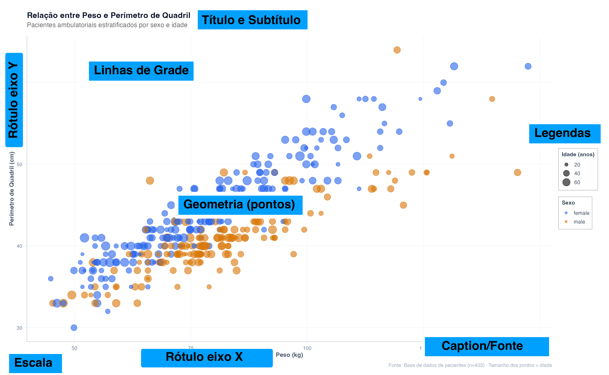

```{r}
#| label: setup
#| include: false
source("_common.R")
```

## Introdução

Um gráfico estatístico bem construído é como uma frase bem escrita: cada elemento tem um propósito. Neste capítulo, vamos desmontar completamente a anatomia de um gráfico e entender o papel de cada componente na comunicação visual de dados. Essa compreensão é fundamental para criar visualizações que informam em vez de confundir.

## Anatomia Completa de um Gráfico

Vamos começar com uma imagem clara e anotada de um gráfico real, usando dados de nossos pacientes. Cada elemento será etiquetado e explicado.

### O Gráfico Completo com Anotações

{fig-align="center" width="100%"}

```{r}
#| eval: false
#| echo: false
#
# ╔══════════════════════════════════════════════════════════════════╗
# ║  CÓDIGO DE REFERÊNCIA — NÃO EXECUTADO                            ║
# ║  Este bloco gerou o gráfico anotado acima usando cowplot.        ║
# ║  A imagem final foi ajustada manualmente e salva como PNG.       ║
# ║  O gráfico exibido no site é: images/Grafico_Anotado.png         ║
# ╚══════════════════════════════════════════════════════════════════╝
#
# ── 1. Criar o gráfico base (limpo, sem anotações) ──
grafico_base <- pacientes |>
  ggplot(aes(x = peso, y = quadril, color = sexo, size = idade)) +
  geom_point(alpha = 0.6) +
  scale_color_manual(values = paleta_sexo) +
  scale_size_continuous(range = c(2, 8), breaks = c(20, 40, 60)) +
  labs(
    title = "Relação entre Peso e Perímetro de Quadril",
    subtitle = "Pacientes ambulatoriais estratificados por sexo e idade",
    x = "Peso (kg)",
    y = "Perímetro de Quadril (cm)",
    color = "Sexo",
    size = "Idade (anos)",
    caption = "Fonte: Base de dados de pacientes (n=403) · Tamanho dos pontos = idade"
  ) +
  tema_graficos() +
  theme(
    plot.margin = margin(t = 20, r = 20, b = 20, l = 20),
    plot.title = element_text(face = "bold", size = 16, margin = margin(b = 5)),
    plot.subtitle = element_text(color = "gray40", size = 13, margin = margin(b = 15)),
    axis.title = element_text(size = 12, face = "bold"),
    axis.text = element_text(size = 10),
    legend.position = "right",
    legend.background = element_rect(fill = "white", color = "gray80"),
    panel.grid.minor = element_blank()
  )

# ── 2. Sobrepor anotações com cowplot::ggdraw() ──
# ggdraw() usa coordenadas normalizadas 0–1 sobre a FIGURA INTEIRA.
# Diferente de annotate(), aqui podemos apontar para título, caption,
# rótulos dos eixos — qualquer elemento, em qualquer posição!

# Coordenadas aproximadas dos elementos na figura 10x8:
#   Painel:    x ~ 0.08–0.72,  y ~ 0.10–0.84
#   Título:    x ~ 0.08,       y ~ 0.96
#   Subtítulo: x ~ 0.08,       y ~ 0.91
#   Eixo X:    x ~ 0.40,       y ~ 0.06
#   Eixo Y:    x ~ 0.02,       y ~ 0.47
#   Caption:   x ~ 0.72,       y ~ 0.01
#   Legenda:   x ~ 0.78–0.95,  y ~ 0.40–0.70

grafico_anotado <- ggdraw(grafico_base) +

  # ── TÍTULO (no topo da figura) ──
  geom_rect(aes(xmin = 0.58, xmax = 0.68, ymin = 0.950, ymax = 0.980),
            fill = "#E53935", inherit.aes = FALSE) +
  draw_label("TÍTULO", x = 0.63, y = 0.965,
             color = "white", fontface = "bold", size = 10) +

  # ── SUBTÍTULO ──
  geom_rect(aes(xmin = 0.56, xmax = 0.70, ymin = 0.850, ymax = 0.880),
            fill = "#FB8C00", inherit.aes = FALSE) +
  draw_label("SUBTÍTULO", x = 0.63, y = 0.865,
             color = "white", fontface = "bold", size = 10) +


  # ── RÓTULO EIXO Y (à esquerda, rotulado verticalmente) ──
  geom_rect(aes(xmin = 0.03, xmax = 0.15, ymin = 0.26, ymax = 0.31),
            fill = "#2E7D32", inherit.aes = FALSE) +
  draw_label("RÓTULO\nEIXO Y", x = 0.09, y = 0.285,
             color = "white", fontface = "bold", size = 8) +

  # ── RÓTULO EIXO X (abaixo do painel) ──
  geom_rect(aes(xmin = 0.50, xmax = 0.75, ymin = 0.105, ymax = 0.135),
            fill = "#1565C0", inherit.aes = FALSE) +
  draw_label("RÓTULO EIXO X", x = 0.605, y = 0.120,
             color = "white", fontface = "bold", size = 9) +

  # ── ESCALA / TICKS (números nos eixos) ──
  geom_rect(aes(xmin = 0.13, xmax = 0.26, ymin = 0.17, ymax = 0.194),
            fill = "#00838F", inherit.aes = FALSE) +
  draw_label("ESCALA", x = 0.195, y = 0.182,
             color = "white", fontface = "bold", size = 9) +

  # ── PONTOS / GEOMETRIA (dentro do painel) ──
  geom_rect(aes(xmin = 0.40, xmax = 0.70, ymin = 0.800, ymax = 0.830),
            fill = "#7B1FA2", inherit.aes = FALSE) +
  draw_label("PONTOS (geometria)", x = 0.555, y = 0.815,
             color = "white", fontface = "bold", size = 9) +

  # ── LEGENDA (à direita do painel) ──
  geom_rect(aes(xmin = 0.75, xmax = 0.95, ymin = 0.800, ymax = 0.830),
            fill = "#795548", inherit.aes = FALSE) +
  draw_label("LEGENDA", x = 0.85, y = 0.815,
             color = "white", fontface = "bold", size = 10) +

  # ── LINHAS DE GRADE ──
  geom_rect(aes(xmin = 0.45, xmax = 0.70, ymin = 0.330, ymax = 0.360),
            fill = "#78909C", inherit.aes = FALSE) +
  draw_label("LINHAS DE GRADE", x = 0.595, y = 0.345,
             color = "white", fontface = "bold", size = 9) +

  # ── CAPTION / FONTE (rodapé da figura) ──
  geom_rect(aes(xmin = 0.25, xmax = 0.55, ymin = 0.010, ymax = 0.040),
            fill = "#B71C1C", inherit.aes = FALSE) +
  draw_label("CAPTION / FONTE", x = 0.39, y = 0.025,
             color = "white", fontface = "bold", size = 9)


grafico_anotado
```

## Explicação de Cada Elemento

### 1. Título e Subtítulo

O título é o cartão de apresentação do seu gráfico. Deve ser:

::: {.callout-tip}
## Boas práticas para título

- **Específico e descritivo**: Não use "Relação entre Variáveis". Use "Relação entre Peso e Perímetro de Quadril em Pacientes Ambulatoriais"
- **Conciso**: Máximo 10-15 palavras
- **Destaque visual**: Use fonte maior e bold
- **No topo do gráfico**: Deixe espaço suficiente abaixo

:::

::: {.callout-warning}
## Erros comuns

- Títulos muito vagos ("Gráfico 1")
- Títulos que simplesmente repetem as variáveis sem contexto
- Texto muito pequeno, dificilmente legível
- Cores que competem com os dados

:::

**Subtítulo**: Fornece contexto adicional. Explique a população, o período de coleta, ou especificidades metodológicas.

```{r}

# Exemplo com ggplot2
ggplot(pacientes, aes(x = peso, y = quadril)) +
  geom_point() +
  labs(
    title = "Relação entre Peso e Perímetro de Quadril",
    subtitle = "Pacientes ambulatoriais estratificados por sexo e idade"
  ) +
  theme(
    plot.title = element_text(face = "bold", size = 16),
    plot.subtitle = element_text(color = "gray40", size = 12)
  )
```

---

### 2. Eixos (Rótulos e Escala)

Os eixos são o mapa de referência do seu gráfico. Cada eixo deve conter:

- **Rótulo claro**: Nome da variável + unidade entre parênteses
- **Escala apropriada**: Começando do zero (para barras) ou não (para scatter plots)
- **Intervalos legíveis**: Não use intervalos estranhos (ex: 0, 1.7, 3.4, 5.1)
- **Fonte legível**: Tamanho mínimo de 10pt

::: {.callout-tip}
## Boas práticas para eixos

- Sempre inclua unidades: "Peso (kg)", "Glicose (mg/dL)"
- Use `scale_x_continuous()` e `scale_y_continuous()` para controlar intervalos
- Evite eixos invertidos sem motivo claro
- Se usar logaritmo, explique no rótulo: "log(Contagem)"

:::

```{r}

# Controle fino dos eixos
ggplot(pacientes, aes(x = peso, y = glicose)) +
  geom_point() +
  scale_x_continuous(
    name = "Peso (kg)",
    breaks = seq(50, 110, by = 10),
    limits = c(50, 110)
  ) +
  scale_y_continuous(
    name = "Glicose em jejum (mg/dL)",
    breaks = seq(60, 180, by = 20)
  )
```

---

### 3. Geometrias

Geometrias são as formas usadas para representar dados: pontos, barras, linhas, áreas.

::: {.callout-info}
## Tipos principais

| Geometria | Função | Melhor para |
|-----------|--------|------------|
| `geom_point()` | Scatter plot | Relações entre duas contínuas |
| `geom_bar()` / `geom_col()` | Barras | Comparação de categorias |
| `geom_line()` | Linhas | Séries temporais |
| `geom_boxplot()` | Box plots | Distribuição por grupos |
| `geom_histogram()` | Histogramas | Distribuição de uma variável |

:::

Cada geometria tem propriedades estéticas (cor, tamanho, forma) que podem ser mapeadas a variáveis:

```{r}
#| fig-width: 10
#| fig-height: 5

# Exemplo: múltiplas estéticas mapeadas a variáveis
p1 <- pacientes |>
  ggplot(aes(x = peso, y = quadril, color = sexo, size = idade)) +
  geom_point(alpha = 0.6) +
  scale_color_manual(values = paleta_sexo) +
  labs(title = "Com cores e tamanhos mapeados") +
  tema_graficos()

# Exemplo: estética constante
p2 <- pacientes |>
  ggplot(aes(x = peso, y = quadril)) +
  geom_point(color = cores$azul, size = 3, alpha = 0.6) +
  labs(title = "Com cores e tamanhos constantes") +
  tema_graficos()

p1 | p2
```

---

### 4. Legendas

Legendas explicam as cores, tamanhos e formas mapeadas aos dados.

::: {.callout-tip}
## Boas práticas para legendas

- **Posição**: Evite sobreposição com dados. Use `legend.position = "right"` ou `"bottom"`
- **Título claro**: Use `color = "Sexo"`, `size = "Idade (anos)"`
- **Ordem**: Organize categorias logicamente (não alfabeticamente, a menos que apropriado)
- **Fundo discreto**: Um fundo levemente opaco melhora legibilidade
- **Remova legendas desnecessárias**: Se uma estética é constante, não precisa de legenda

:::

```{r}

# Legenda customizada
ggplot(pacientes, aes(x = peso, y = quadril, color = sexo, size = idade)) +
  geom_point(alpha = 0.6) +
  scale_color_manual(
    values = paleta_sexo,
    name = "Sexo do Paciente"
  ) +
  scale_size_continuous(
    name = "Idade (anos)",
    range = c(2, 8)
  ) +
  theme(
    legend.position = "right",
    legend.background = element_rect(fill = "white", color = "gray80"),
    legend.title = element_text(face = "bold")
  )
```

---

### 5. Grid Lines (Linhas de Grade)

Linhas de grade facilitam a leitura de valores no gráfico.

::: {.callout-tip}
## Boas práticas para grid lines

- **Grid maior**: Deve ser visível mas não competir com os dados
- **Grid menor**: Remova linhas menores (`element_blank()`) para limpeza visual
- **Cor sutil**: Use cinza claro, não preto
- **Para barras horizontais**: Apenas grid vertical (x) geralmente funciona melhor

:::

::: {.callout-warning}
## Evite

- Grid muito denso e escuro que compete com os dados
- Linhas contínuas em ambas as direções quando não necessário
- Grid em gráficos com muita densidade de pontos

:::

```{r}

# Exemplo de controle fino de grid
ggplot(pacientes, aes(x = peso, y = quadril)) +
  geom_point() +
  theme(
    panel.grid.major = element_line(color = "gray90", size = 0.3),
    panel.grid.minor = element_blank(),
    panel.background = element_rect(fill = "white", color = "gray70")
  )
```

---

### 6. Notas de Rodapé (Caption)

A caption fornece contexto crucial: fonte dos dados, tamanho da amostra, metodologia.

::: {.callout-tip}
## Boas práticas para caption

- **Sempre cite a fonte**: "Fonte: Base de dados de pacientes ambulatoriais"
- **Inclua n**: "n=403 pacientes"
- **Explique transformações**: "Nota: Dados foram log-transformados"
- **Metodologia especial**: "Outliers definidos como >3 desvios padrão foram excluídos"

:::

```{r}

labs(
  caption = "Fonte: Base de dados de pacientes ambulatoriais (n=403, 2020-2024)\nNota: Valores faltantes não foram incluídos. Idade representada pelo tamanho dos pontos."
)
```

---

### 7. Anotações

Anotações são setas, retângulos e textos que destacam pontos importantes.

```{r}
#| fig-width: 10
#| fig-height: 6

# Gráfico com anotações para destaque
pacientes |>
  ggplot(aes(x = idade, y = glicose, color = sexo)) +
  geom_point(size = 3, alpha = 0.6) +
  scale_color_manual(values = paleta_sexo) +

  # Anotação: seta indicando valor alto
  annotate("segment",
           x = 65, xend = 62,
           y = 190, yend = 175,
           arrow = arrow(length = unit(0.3, "cm")),
           color = "red", size = 1) +
  annotate("text",
           x = 66, y = 192,
           label = "Glicose\nelevada\n(pré-diabetes)",
           color = "red", fontface = "bold",
           size = 3.5, hjust = 0) +

  # Anotação: retângulo destacando zona de risco
  annotate("rect",
           xmin = 50, xmax = 75,
           ymin = 140, ymax = 200,
           alpha = 0.1, fill = "red",
           color = "red", linetype = "dashed") +
  annotate("text",
           x = 62.5, y = 145,
           label = "Zona de\nRisco",
           color = "red", fontface = "bold",
           size = 3.5, hjust = 0.5) +

  labs(
    title = "Glicose de Jejum vs Idade",
    x = "Idade (anos)",
    y = "Glicose (mg/dL)",
    color = "Sexo"
  ) +
  tema_graficos()
```


---


## Quiz de Verificação

Teste sua compreensão dos elementos de um gráfico:

**Pergunta 1:** Qual é o propósito principal de um título em um gráfico?

- A) Ocupar espaço no topo
- B) Comunicar claramente o que o gráfico mostra
- C) Seguir convenção de publicação
- D) Ambas B e C

**Pergunta 2:** Quando você mapeia uma variável a uma estética (como cor ou tamanho), o que você precisa incluir?

- A) Apenas a legenda
- B) Uma nota de rodapé explicando
- C) Tanto a legenda quanto a nota de rodapé
- D) Nenhum dos anteriores

**Pergunta 3:** Qual elemento do gráfico é ESSENCIAL para explicar de onde vieram os dados?

- A) Título
- B) Legenda
- C) Caption/Nota de rodapé
- D) Grid lines

---

## Resumo dos Elementos

| Elemento | Função | Essencial? |
|----------|--------|-----------|
| Título | Comunicar o assunto | Sim |
| Subtítulo | Contexto adicional | Não |
| Rótulos de eixos | Identificar variáveis e unidades | Sim |
| Escala dos eixos | Permitir leitura de valores | Sim |
| Geometria | Representar os dados | Sim |
| Legenda | Explicar mapeamentos estéticos | Depende |
| Grid lines | Facilitar leitura | Não |
| Caption | Citar fonte e contexto | Sim |
| Anotações | Destacar insights | Não |

---

## Referências {.unnumbered}

::: {#refs}
:::
