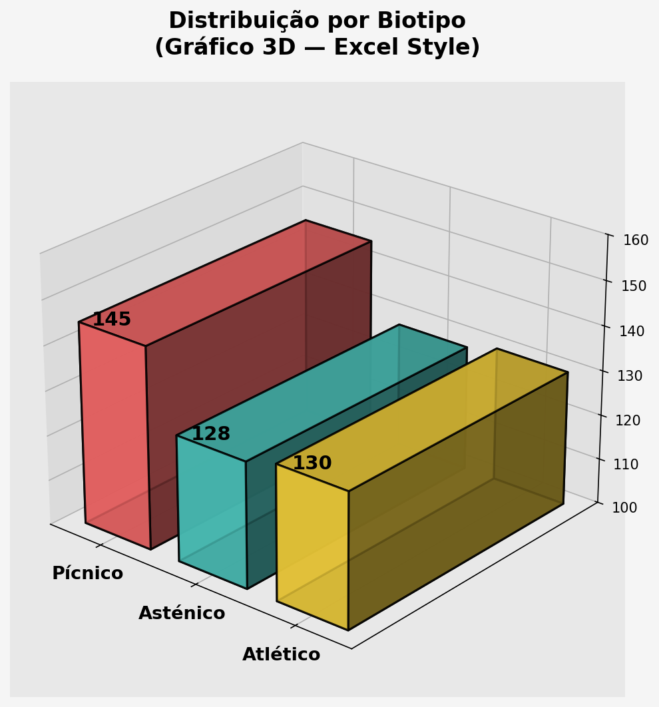

```{r}
#| label: setup
#| include: false
source("_common.R")
```

## Introdução

Edward Tufte é amplamente reconhecido como o "Galileu dos Gráficos" — um estatístico e artista visual cuja obra revolucionou a forma como pensamos sobre visualização de dados. Seus princípios não são apenas dicas estéticas; são fundamentos científicos sobre como os humanos interpretam informação visual. Neste capítulo, você aprenderá a aplicar esses princípios para criar gráficos que comunicam com integridade e clareza.

## Quem é Edward Tufte?

Edward Tufte é um estatístico americano, professor emérito da Universidade de Yale e autoridade mundial em visualização de dados. Seu trabalho comenzou na década de 1980 e revolucionou o campo com obras seminais como:

- ***The Visual Display of Quantitative Information*** [@tufte2001] — O livro fundador sobre design de gráficos
- ***Envisioning Information*** [@tufte1990] — Sobre multidimensionalidade e densidade de informação
- ***Visual Explanations*** [@tufte1997] — A importância de causação e documentação visual

Tufte argumenta que gráficos ruins não são apenas feios — são **enganosos**. Eles podem distorcer a percepção dos dados, enganar leitores (às vezes intencionalmente) e levar a decisões ruins em medicina, negócios e política. Seus princípios nos ensinam a ser honestos com os dados.

---

## Princípio 1: Data-Ink Ratio (Razão Dados-Tinta)

### O Conceito

A **Data-Ink Ratio** é a proporção de "tinta" (pixels na tela) dedicada a representar dados, versus tinta usada em decoração desnecessária:

$$\text{Data-Ink Ratio} = \frac{\text{Tinta usada para dados}}{\text{Tinta total no gráfico}}$$

::: {.callout-important}
## Princípio de Tufte

**Maximize o Data-Ink Ratio. Remova cada elemento que não contribui diretamente à compreensão dos dados.**

:::

### Demonstração Prática: Removendo Elementos Desnecessários

Vamos começar com um gráfico padrão e progressivamente remover elementos decorativos:

```{r}
#| fig-width: 14
#| fig-height: 10

# Preparar dados agregados
glicose_por_biotipo <- pacientes |>
  group_by(biotipo) |>
  summarise(
    media_glicose = mean(glicose, na.rm = TRUE),
    desvio = sd(glicose, na.rm = TRUE),
    n = n(),
    .groups = 'drop'
  ) |>
  mutate(se = desvio / sqrt(n))

# Versão 1: Padrão (com muito chartjunk)
p1 <- glicose_por_biotipo |>
  ggplot(aes(x = biotipo, y = media_glicose, fill = biotipo)) +
  geom_col(width = 0.7) +
  geom_errorbar(aes(ymin = media_glicose - se, ymax = media_glicose + se),
                width = 0.2, color = "black", size = 1) +
  scale_fill_manual(values = paleta_cat) +
  theme(
    plot.background = element_rect(fill = "lightgray", color = "black", size = 2),
    panel.background = element_rect(fill = "white", color = "black", size = 2),
    panel.grid.major.y = element_line(color = "white", size = 1),
    panel.grid.minor.y = element_line(color = "lightblue", size = 0.5),
    legend.background = element_rect(fill = "lightyellow", color = "black", size = 1),
    axis.text = element_text(size = 12, color = "black", face = "bold"),
    plot.title = element_text(size = 14, face = "bold", color = "darkblue")
  ) +
  labs(
    title = "Versão 1: Com 'Chartjunk'",
    x = "Biótipo",
    y = "Glicose Média (mg/dL)",
    fill = "Biótipo"
  )

# Versão 2: Remover cores decorativas (manter cor funcional)
p2 <- glicose_por_biotipo |>
  ggplot(aes(x = biotipo, y = media_glicose)) +
  geom_col(fill = cores$azul, width = 0.7, color = "black", size = 0.5) +
  geom_errorbar(aes(ymin = media_glicose - se, ymax = media_glicose + se),
                width = 0.2, color = "black", size = 0.5) +
  theme_minimal() +
  theme(
    panel.grid.major.x = element_blank(),
    panel.grid.minor = element_blank(),
    axis.text = element_text(size = 11),
    plot.title = element_text(size = 13, face = "bold")
  ) +
  labs(
    title = "Versão 2: Sem cores decorativas",
    x = "Biótipo",
    y = "Glicose Média (mg/dL)"
  )

# Versão 3: Remover grid lines (dados já são lidos pelo eixo Y)
p3 <- glicose_por_biotipo |>
  ggplot(aes(x = biotipo, y = media_glicose)) +
  geom_col(fill = cores$azul, width = 0.7, color = "black", size = 0.5) +
  geom_errorbar(aes(ymin = media_glicose - se, ymax = media_glicose + se),
                width = 0.15, color = "black", size = 0.5) +
  theme_minimal() +
  theme(
    panel.grid = element_blank(),
    axis.line = element_line(color = "black", size = 0.5),
    axis.text = element_text(size = 11),
    plot.title = element_text(size = 13, face = "bold")
  ) +
  labs(
    title = "Versão 3: Sem grid lines",
    x = "Biótipo",
    y = "Glicose Média (mg/dL)"
  )

# Versão 4: Remover molduras (spines)
p4 <- glicose_por_biotipo |>
  ggplot(aes(x = biotipo, y = media_glicose)) +
  geom_col(fill = cores$azul, width = 0.5, color = "black", size = 0.4) +
  geom_errorbar(aes(ymin = media_glicose - se, ymax = media_glicose + se),
                width = 0.1, color = "black", size = 0.4) +
  theme_minimal() +
  theme(
    panel.grid = element_blank(),
    axis.line.y = element_line(color = "black", size = 0.5),
    axis.line.x = element_blank(),
    axis.text = element_text(size = 11),
    axis.ticks.x = element_blank(),
    plot.title = element_text(size = 13, face = "bold")
  ) +
  labs(
    title = "Versão 4: Sem molduras laterais",
    x = "Biótipo",
    y = "Glicose Média (mg/dL)"
  )

# Montar em grid
(p1 + p2) / (p3 + p4)
```

### Lições Práticas

::: {.callout-tip}
## Maximizar Data-Ink Ratio

1. **Remova backgrounds coloridos**: O fundo branco é neutro e não compete com dados
2. **Simplifique legendas**: Remova bordas, fundos coloridos
3. **Minimize grid lines**: Se incluir, use cores muito claras (cinza 90%)
4. **Remova decorações 3D**: Não adiciona informação, apenas confunde percepção
5. **Use cores com propósito**: Cada cor deve representar uma dimensão de dados
6. **Evite fontes ornamentadas**: Use sans-serif (Arial, Helvetica) para clareza

:::

```{r}
#| eval: false
# Exemplo de código para alta Data-Ink Ratio
ggplot(pacientes, aes(x = biotipo, y = glicose)) +
  geom_boxplot(fill = cores$azul, color = "black") +
  theme_minimal() +
  theme(
    panel.grid = element_blank(),
    axis.line.y = element_line(color = "black", size = 0.5),
    axis.line.x = element_blank(),
    axis.text = element_text(size = 10),
    axis.title = element_text(size = 11, face = "bold")
  ) +
  labs(
    x = "Biótipo",
    y = "Glicose (mg/dL)"
  )
```

---

## Princípio 2: Chartjunk e Desonestidade Visual

### O que é Chartjunk?

**Chartjunk** são elementos visuais que não transmitem dados:

- Efeitos 3D que distorcem proporções
- Texturas desnecessárias
- Gradientes de cores sem significado
- Figuras decorativas (pessoas, animais, objetos)
- Sombras e brilhos
- Fontes ornamentadas

::: {.callout-warning}
## Perigo do Chartjunk

Chartjunk não é apenas feio — **distorce a percepção**. Nossos olhos são enganados por perspectiva 3D, gradientes que fazem certas cores parecerem maiores, e outros efeitos visuais.

:::

### Exemplo: Gráficos de Barras 3D Enganosos

{fig-align="center" width="65%"}

Agora compare com a versão honesta:

```{r}
#| label: tufte-3d-honesta
#| fig-height: 5

# Preparar dados
contagem_biotipo <- pacientes |>
  count(biotipo) |>
  arrange(desc(n))

# Versão honesta
contagem_biotipo |>
  ggplot(aes(x = reorder(biotipo, n), y = n, fill = "blue")) +
  geom_col(width = 0.6, color = "black", linewidth = 0.5) +
  geom_text(aes(label = n), vjust = -0.5, size = 5, fontface = "bold") +
  scale_fill_manual(values = paleta_cat) +
  scale_y_continuous(limits = c(0, max(contagem_biotipo$n) * 1.1)) +
  labs(
    title = "HONESTA: 2D sem decorações",
    subtitle = "Proporções verdadeiras, eixo começando em zero",
    x = "Biótipo",
    y = "Contagem"
  ) +
  tema_graficos() +
  theme(legend.position = "none")
```

### Cores Enganosas

Gradientes de cores podem fazer dados pequenos parecerem grandes:

```{r}
#| fig-width: 12
#| fig-height: 5

# Dados para demonstração
dados_vendas <- tibble(
  produto = c("A", "B", "C", "D"),
  vendas = c(100, 110, 105, 115)
)

# Versão enganosa: gradiente faz produto D parecer muito maior
p_grad <- dados_vendas |>
  ggplot(aes(x = produto, y = vendas, fill = vendas)) +
  geom_col() +
  scale_fill_gradient(low = "lightblue", high = "darkblue") +
  ylim(0, 120) +
  labs(
    title = "ENGANOSA: Gradiente distorce percepção",
    subtitle = "Os valores são muito similares (100-115), mas parecem muito diferentes",
    x = "Produto",
    y = "Vendas (unidades)"
  ) +
  theme_minimal() +
  theme(legend.position = "none")

# Versão honesta: cor uniforme
p_cor_uni <- dados_vendas |>
  ggplot(aes(x = produto, y = vendas)) +
  geom_col(fill = cores$azul, color = "black", size = 0.5) +
  ylim(0, 120) +
  labs(
    title = "HONESTA: Cor uniforme",
    subtitle = "Diferenças pequenas são vistas como realmente pequenas",
    x = "Produto",
    y = "Vendas (unidades)"
  ) +
  theme_minimal()

p_grad | p_cor_uni
```

---

## Princípio 3: Lie Factor (Fator de Mentira)

### A Fórmula

Tufte define o **Lie Factor** como a razão entre o efeito gráfico e o efeito de dados real:

$$\text{Lie Factor} = \frac{\text{Tamanho da diferença visual}}{\text{Tamanho real da diferença de dados}}$$

::: {.callout-important}
## Critério de Integridade

**Um gráfico é visualmente honesto quando o Lie Factor está entre 0.95 e 1.05.**

Acima de 1.05, o gráfico exagera visualmente as diferenças. Abaixo de 0.95, minimiza as diferenças.

:::

### Exemplo: Medicação Fictícia

Suponha uma medicação que reduz um biomarcador de 100 para 95 (redução de 5%). Vamos criar versões honestas e desonestas:

```{r}
#| fig-width: 14
#| fig-height: 6

# Dados
eficacia <- tibble(
  momento = c("Antes", "Depois"),
  biomarcador = c(100, 95)
)

# Versão DESONESTA: Começar no eixo Y não em zero (Lie Factor alto)
p_desonesta <- eficacia |>
  ggplot(aes(x = momento, y = biomarcador, fill = momento)) +
  geom_col(width = 0.6, color = "black", size = 1) +
  scale_fill_manual(values = c("Antes" = cores$vermelho, "Depois" = cores$verde)) +
  coord_cartesian(ylim = c(92, 101)) +  # Exagera a diferença!
  annotate("text", x = 1.5, y = 100, label = "Redução de 5%\nparece enorme!",
           fontface = "bold", color = "red", size = 4) +
  labs(
    title = "DESONESTA: Começar em 92 (não zero)",
    subtitle = "Lie Factor ≈ 3.3 (redução de 5% parece 33%)",
    x = "Momento",
    y = "Biomarcador"
  ) +
  theme_minimal() +
  theme(legend.position = "none")

# Versão HONESTA: Eixo começando no zero
p_honesta <- eficacia |>
  ggplot(aes(x = momento, y = biomarcador, fill = momento)) +
  geom_col(width = 0.6, color = "black", size = 1) +
  scale_fill_manual(values = c("Antes" = cores$vermelho, "Depois" = cores$verde)) +
  coord_cartesian(ylim = c(0, 105)) +  # Começa no zero
  annotate("text", x = 1.5, y = 50, label = "Redução de 5%\napenas 5%",
           fontface = "bold", color = "darkgreen", size = 4) +
  labs(
    title = "HONESTA: Eixo começa em zero",
    subtitle = "Lie Factor = 1.0 (proporções verdadeiras)",
    x = "Momento",
    y = "Biomarcador"
  ) +
  theme_minimal() +
  theme(legend.position = "none")

p_desonesta | p_honesta
```

::: {.callout-danger}
## Aviso Importante

Essa tática de começar o eixo não em zero é **muito comum em publicidade e política**. Agora que você sabe, desconfia de gráficos que parecem mostrar mudanças dramáticas!

:::

### Cálculo do Lie Factor

```{r}
#| eval: false
# No exemplo anterior:
# - Diferença real de dados: (100 - 95) / 100 = 5%
# - Na versão desonesta: altura de 100 → altura de 95, em escala 92-101
#   = diferença visual de 8 unidades em 9 unidades de escala
#   = aproximadamente 89% visualmente
# - Lie Factor = 89% / 5% = 17.8 (dramaticamente desonesto!)
```

---

## Princípio 4: Small Multiples (Pequenos Múltiplos)

### O Conceito

Em vez de criar um gráfico complexo com múltiplas linhas, cores ou dimensões, **crie muitos gráficos pequenos e simples**.

::: {.callout-tip}
## Vantagens dos Small Multiples

- **Mais fácil ler**: Cada pequeno gráfico é simples
- **Sem legendas confusas**: Cada painel é autoexplicativo
- **Comparação clara**: Seu olho passa de um para outro naturalmente
- **Escalas independentes**: Possíveis quando apropriado
- **ggplot2**: Use `facet_wrap()` ou `facet_grid()`

:::

### Exemplo: Glicose por Biótipo

```{r}
#| fig-width: 12
#| fig-height: 5

# Versão com legendas confusas (difícil ler)
p_confusa <- pacientes |>
  ggplot(aes(x = idade, y = glicose, color = biotipo, shape = sexo)) +
  geom_point(size = 2, alpha = 0.6) +
  scale_color_manual(values = paleta_cat) +
  labs(
    title = "CONFUSA: Múltiplas dimensões em um gráfico",
    subtitle = "4 variáveis simultâneas (X, Y, cor, forma)",
    x = "Idade (anos)",
    y = "Glicose (mg/dL)",
    color = "Biótipo",
    shape = "Sexo"
  ) +
  theme_minimal()

# Versão com small multiples (claro)
p_clara <- pacientes |>
  ggplot(aes(x = idade, y = glicose, color = sexo)) +
  geom_point(size = 2, alpha = 0.6) +
  scale_color_manual(values = paleta_sexo) +
  facet_wrap(~biotipo, nrow = 2) +
  labs(
    title = "CLARA: Pequenos Múltiplos por Biótipo",
    subtitle = "Cada painel mostra um biótipo, eliminando confusão visual",
    x = "Idade (anos)",
    y = "Glicose (mg/dL)",
    color = "Sexo"
  ) +
  tema_graficos() +
  theme(
    legend.position = "bottom",
    strip.text = element_text(face = "bold", size = 11)
  )

p_confusa / p_clara
```

### Casos de Uso Ideais

```{r}
#| fig-width: 14
#| fig-height: 8

# Exemplo 1: Distribuição por grupo com facet_wrap
p1 <- pacientes |>
  ggplot(aes(x = peso, fill = sexo)) +
  geom_histogram(bins = 20, alpha = 0.7, color = "black", size = 0.3) +
  scale_fill_manual(values = paleta_sexo) +
  facet_wrap(~biotipo) +
  labs(
    title = "Distribuição de Peso por Sexo e Biótipo",
    x = "Peso (kg)",
    y = "Frequência",
    fill = "Sexo"
  ) +
  tema_graficos() +
  theme(legend.position = "bottom")

# Exemplo 2: Dispersão com facet_grid (organizando por duas variáveis)
p2 <- pacientes |>
  filter(!is.na(sexo), !is.na(biotipo)) |>
  ggplot(aes(x = cintura, y = colesterol, color = sexo)) +
  geom_point(size = 2.5, alpha = 0.6) +
  geom_smooth(method = "lm", se = FALSE, size = 0.8) +
  scale_color_manual(values = paleta_sexo) +
  facet_grid(biotipo ~ sexo) +
  labs(
    title = "Colesterol vs Perímetro de Cintura",
    subtitle = "Estratificado por Biótipo e Sexo",
    x = "Perímetro de Cintura (cm)",
    y = "Colesterol Total (mg/dL)",
    color = "Sexo"
  ) +
  tema_graficos() +
  theme(
    strip.text = element_text(face = "bold", size = 10),
    legend.position = "bottom"
  )

p1 / p2
```

---

## Princípio 5: Sparklines — Gráficos do Tamanho de Uma Palavra

### O que são sparklines?

Em 2006, Edward Tufte introduziu um conceito elegante em *Beautiful Evidence* [@tufte2006]: **gráficos tão pequenos que cabem dentro de uma frase**, como se fossem palavras. Ele os chamou de *sparklines* — pequenas linhas de dados, intensas, simples, do tamanho de uma palavra (*word-sized graphics*).

A ideia é revolucionária: em vez de interromper o texto para mostrar um gráfico em uma figura separada, você **embutia o gráfico dentro da própria tabela ou parágrafo**, como uma extensão natural da informação.

> *"A sparkline is a small intense, simple, word-sized graphic with typographic resolution."*
> — Edward Tufte, *Beautiful Evidence* (2006)

### Por que isso importa na prática clínica?

Imagine um prontuário eletrônico. Em vez de mostrar apenas o último valor de glicemia do paciente, a sparkline mostra **a tendência dos últimos dias** diretamente ao lado do número — sem precisar abrir um gráfico separado, sem navegar para outra tela.

As regras são simples: nada de eixos, nada de legendas, nada de títulos. Apenas a linha (ou as barras) com os dados, no menor espaço possível. O contexto vem do texto ou da tabela ao redor.

### Exemplo: Sparklines dentro de uma tabela

Vamos criar uma tabela em que cada linha mostra o resumo de um biótipo **e** uma sparkline com a distribuição real dos pesos dos pacientes daquele grupo. Compare com uma tabela convencional — a diferença de densidade informacional é enorme.

**Tabela convencional (apenas números):**

```{r}
resumo_bio <- pacientes |>
  group_by(biotipo) |>
  summarise(
    n = n(),
    peso_medio = round(mean(peso, na.rm = TRUE), 1),
    peso_dp = round(sd(peso, na.rm = TRUE), 1),
    glicose_media = round(mean(glicose, na.rm = TRUE), 0),
    .groups = 'drop'
  )

kbl(resumo_bio,
    col.names = c("Biótipo", "N", "Peso Médio", "DP Peso", "Glicose Média"),
    format = "html") |>
  kable_styling(bootstrap_options = c("striped", "hover", "condensed"),
                full_width = FALSE, position = "center")
```

Agora a mesma tabela, mas com sparklines — minigráficos embutidos que mostram **como os pesos se distribuem** em cada biótipo:

**Tabela com sparklines (dados + padrão visual):**

```{r}
# Extrair os vetores de peso por biótipo (ordenados)
pesos_por_bio <- pacientes |>
  arrange(biotipo, peso) |>
  group_by(biotipo) |>
  summarise(
    n = n(),
    peso_medio = round(mean(peso, na.rm = TRUE), 1),
    glicose_media = round(mean(glicose, na.rm = TRUE), 0),
    peso_lista = list(peso),
    glicose_lista = list(sort(glicose)),
    .groups = 'drop'
  )

# Criar dataframe para exibição (com colunas placeholder para sparklines)
tabela_exibir <- pesos_por_bio |>
  mutate(spark_peso = "", spark_glicose = "") |>
  select(biotipo, n, peso_medio, glicose_media, spark_peso, spark_glicose)

# Criar a tabela com sparklines embutidas
kbl(tabela_exibir,
    col.names = c("Biótipo", "N", "Peso Médio", "Glicose Média",
                  "Tendência Peso", "Tendência Glicose"),
    format = "html") |>
  kable_styling(bootstrap_options = c("striped", "hover", "condensed"),
                full_width = FALSE, position = "center") |>
  column_spec(5, image = spec_plot(pesos_por_bio$peso_lista,
                                    same_lim = TRUE,
                                    width = 200, height = 30,
                                    col = cores$azul,
                                    cex = 1)) |>
  column_spec(6, image = spec_plot(pesos_por_bio$glicose_lista,
                                    same_lim = TRUE,
                                    width = 200, height = 30,
                                    col = cores$verde,
                                    cex = 1))
```

::: {.callout-tip}
## O que ganhamos com sparklines?

Observe como a tabela com sparklines comunica muito mais do que a tabela convencional, **sem ocupar espaço adicional significativo**. De relance, você percebe que os pacientes obesos têm pesos mais dispersos, que a glicemia varia mais em certos biótipos, e qual é o formato geral de cada distribuição. Tudo isso seria invisível em uma tabela apenas com médias e desvios-padrão.
:::

### Sparklines como barras

Sparklines não precisam ser linhas. Podem ser também **pequenas barras**, úteis para mostrar proporções ou contagens. Veja uma versão com barras para a distribuição de peso:

```{r}
# Criar histogramas como sparklines (barras)
hist_por_bio <- pacientes |>
  group_by(biotipo) |>
  summarise(
    n = n(),
    peso_medio = round(mean(peso, na.rm = TRUE), 1),
    hist_vals = list({
      h <- hist(peso, breaks = seq(min(peso, na.rm = TRUE),
                                    max(peso, na.rm = TRUE),
                                    length.out = 15), plot = FALSE)
      h$counts
    }),
    .groups = 'drop'
  )

# Dataframe com coluna placeholder para sparkline
tabela_hist <- hist_por_bio |>
  mutate(distribuicao = "") |>
  select(biotipo, n, peso_medio, distribuicao)

kbl(tabela_hist,
    col.names = c("Biótipo", "N", "Peso Médio (kg)", "Distribuição"),
    format = "html") |>
  kable_styling(bootstrap_options = c("striped", "hover", "condensed"),
                full_width = FALSE, position = "center") |>
  column_spec(4, image = spec_plot(hist_por_bio$hist_vals,
                                    same_lim = TRUE,
                                    width = 200, height = 30,
                                    col = cores$ambar,
                                    border = NA))
```

### O princípio por trás

O que Tufte nos ensina com as sparklines é um princípio mais amplo: **maximize a densidade de informação**. Cada pixel da sua comunicação deve trabalhar a favor do leitor. Uma tabela com sparklines respeita o tempo do leitor ao eliminar a necessidade de alternar entre tabelas e gráficos — os dados e os padrões visuais convivem no mesmo espaço.

Nas palavras de Tufte: o objetivo é atingir **resolução tipográfica** — gráficos tão integrados ao texto quanto as próprias letras.

---

## Resumo dos Princípios de Tufte

| Princípio | Definição | Ação Prática |
|-----------|-----------|-------------|
| **Data-Ink Ratio** | Maximizar tinta de dados | Remova decorações, backgrounds, gridlines excessivas |
| **Chartjunk** | Evitar elementos inúteis | Sem 3D, sem gradientes decorativos, sem figuras |
| **Lie Factor** | Manter honestidade visual | Eixos começam em zero (para barras), proporções verdadeiras |
| **Small Multiples** | Simplifique com repetição | Use `facet_wrap()` em vez de legendas complexas |
| **Sparklines** | Densidade de informação | Gráficos minúsculos em tabelas para padrões rápidos |

---

## Quiz: Aplicando Tufte

**Pergunta 1:** Um gráfico de barras mostra uma redução de 10% em mortalidade após uma intervenção, mas o eixo Y vai de 0% a 100%. Qual é aproximadamente o Lie Factor?

A) 1.0 (honesto)
B) 2.5 (exagerado)
C) 0.5 (minimizado)
D) 1.05 (ligeiramente exagerado)

**Pergunta 2:** Você precisa mostrar como a glicose varia por 4 biótipos, em 2 sexos, e 3 faixas de idade. O que Tufte sugeriria?

A) Usar cores diferentes para cada variável, com legend complexa
B) Usar `facet_wrap()` para criar múltiplos gráficos simples
C) Usar gráficos 3D para mostrar todas as dimensões
D) Usar símbolos diferentes (▲ ● ■) para cada categoria

**Pergunta 3:** O que é chartjunk?

A) Gráficos de lixo ou dados ruins
B) Elementos visuais que não transmitem dados (3D, gradientes desnecessários)
C) Qualquer cores em um gráfico
D) Linhas de grade

**Pergunta 4:** Qual prática maximiza o Data-Ink Ratio?

A) Adicionar mais cores decorativas
B) Usar backgrounds interessantes
C) Remover grid lines menores e backgrounds coloridos
D) Incluir efeitos 3D

---

## Referências {.unnumbered}

::: {#refs}
:::

