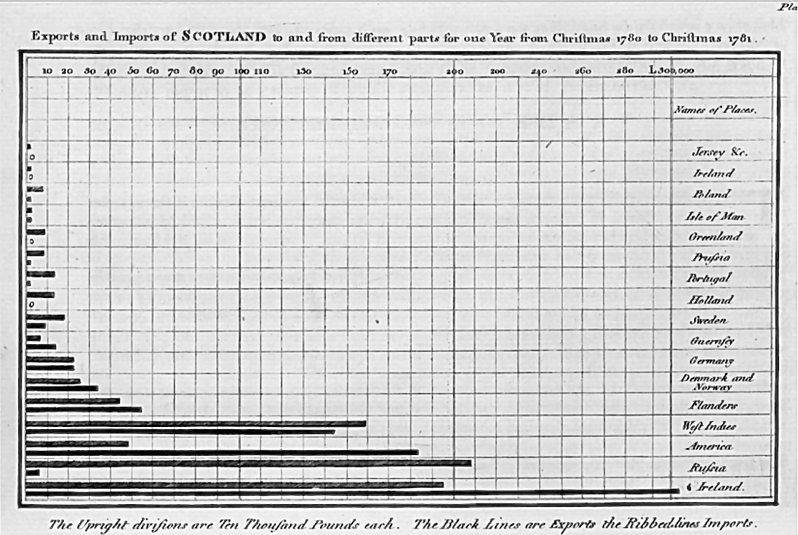

```{r}
#| label: setup
#| include: false
source("_common.R")
```

## História: William Playfair e o Gráfico de Barras

::: {.callout-note appearance="minimal"}

## Playfair de novo: uma invenção que sobrevive há mais de dois séculos

Mais uma vez, devemos esse gráfico a **William Playfair** — o mesmo escocês que conhecemos no capítulo sobre o gráfico de pizza. Na verdade, as barras vieram *antes* da pizza: Playfair as introduziu em *The Commercial and Political Atlas* [@playfair1786], a mesma obra que contém os primeiros gráficos de linhas da história [@costiganeaves1990].

O gráfico de barras foi adotado rapidamente pela comunidade científica porque funciona de forma intuitiva: **quanto mais alta a barra, maior o valor**. Essa simplicidade, combinada com eficácia, fez do gráfico de barras um dos mais duráveis e confiáveis métodos de visualização de dados nos últimos 240 anos. Ao contrário de outras representações que caíram em desuso, o gráfico de barras mantém sua relevância até hoje em pesquisa científica, relatórios médicos e apresentações de dados.



:::

## O que é um gráfico de barras?

Um gráfico de barras é uma visualização que **compara frequências ou contagens de categorias** usando barras retangulares. A altura (ou comprimento) de cada barra é proporcional ao valor que ela representa.

Componentes principais:

- **Eixo horizontal (X)**: Contém as categorias
- **Eixo vertical (Y)**: Contém a escala numérica (frequências, contagens, etc.)
- **Barras**: Retângulos cuja altura representa o valor de cada categoria
- **Rótulos**: Títulos, nomes de categorias e, frequentemente, valores numéricos

Diferentemente de um histograma (que é para dados contínuos com bins), o gráfico de barras é para **dados categóricos** ou **contagens de frequência**.

## Tipos de gráficos de barras

O gráfico de barras é versátil e pode ser usado de várias formas. Vamos explorar as principais:

::: {.panel-tabset}

### Barras Simples

O tipo mais básico: uma única variável categórica com suas frequências.

**Caso de uso:** Mostrar a distribuição de uma única característica na amostra.

```{r}
# Contar frequências de biotipo
dados_biotipo <- pacientes |>
  count(biotipo) |>
  mutate(biotipo_label = factor(
    biotipo,
    levels = c("small", "medium", "large"),
    labels = c("Pequeno", "Médio", "Grande")
  )) |>
  arrange(desc(n))

# Gráfico de barras simples
ggplot(dados_biotipo, aes(x = biotipo_label, y = n, fill = biotipo)) +
  geom_col(width = 0.6, show.legend = FALSE) +
  geom_text(
    aes(label = n),
    vjust = -0.3,
    fontface = "bold",
    size = 4
  ) +
  scale_y_continuous(limits = c(0, 200), breaks = seq(0, 200, 40)) +
  scale_fill_manual(values = c(
    "small" = cores$azul,
    "medium" = cores$verde,
    "large" = cores$laranja
  )) +
  labs(
    title = "Distribuição de Biotipo na Amostra",
    subtitle = "Gráfico de barras simples: uma variável categórica",
    x = "Biotipo",
    y = "Número de Pacientes"
  ) +
  tema_graficos()
```

### Barras Lado a Lado

Compara duas variáveis categóricas, mostrando as categorias da primeira variável no eixo X, e usando cores para distinguir as categorias da segunda.

**Caso de uso:** Comparar como uma distribuição varia entre grupos.

```{r}
# Biotipo separado por sexo
dados_biotipo_sexo <- pacientes |>
  count(biotipo, sexo) |>
  mutate(
    biotipo_label = factor(
      biotipo,
      levels = c("small", "medium", "large"),
      labels = c("Pequeno", "Médio", "Grande")
    ),
    sexo_label = ifelse(sexo == "female", "Mulher", "Homem")
  )

# Gráfico lado a lado
ggplot(dados_biotipo_sexo, aes(x = biotipo_label, y = n, fill = sexo)) +
  geom_col(position = position_dodge(width = 0.8), width = 0.7) +
  geom_text(
    aes(label = n),
    position = position_dodge(width = 0.8),
    vjust = -0.3,
    fontface = "bold",
    size = 3.5
  ) +
  scale_fill_manual(
    values = paleta_sexo,
    labels = c("female" = "Mulher", "male" = "Homem")
  ) +
  scale_y_continuous(limits = c(0, 130)) +
  labs(
    title = "Distribuição de Biotipo por Sexo",
    subtitle = "Gráfico lado a lado: duas variáveis categóricas",
    x = "Biotipo",
    y = "Número de Pacientes",
    fill = "Sexo"
  ) +
  tema_graficos()
```

### Barras Empilhadas

As categorias da segunda variável são empilhadas verticalmente dentro de cada barra. Útil para ver tanto o total quanto a composição.

**Caso de uso:** Mostrar a composição dentro de cada categoria, mantendo visível o total.

```{r}
# Biotipo separado por sexo
dados_biotipo_sexo <- pacientes |>
  count(biotipo, sexo) |>
  mutate(
    biotipo_label = factor(
      biotipo,
      levels = c("small", "medium", "large"),
      labels = c("Pequeno", "Médio", "Grande")
    ),
    sexo_label = ifelse(sexo == "female", "Mulher", "Homem")
  )

# Gráfico empilhado
ggplot(dados_biotipo_sexo, aes(x = biotipo_label, y = n, fill = sexo)) +
  geom_col(width = 0.6) +
  geom_text(
    aes(label = n),
    position = position_stack(vjust = 0.5),
    fontface = "bold",
    size = 4,
    color = "white"
  ) +
  scale_fill_manual(
    values = paleta_sexo,
    labels = c("female" = "Mulher", "male" = "Homem")
  ) +
  scale_y_continuous(limits = c(0, 200)) +
  labs(
    title = "Distribuição de Biotipo por Sexo",
    subtitle = "Gráfico empilhado: composição dentro de cada categoria",
    x = "Biotipo",
    y = "Número de Pacientes",
    fill = "Sexo"
  ) +
  tema_graficos()
```

### Barras Percentuais (100% Empilhado)

Todas as barras têm a mesma altura (100%), mostrando apenas a proporção de cada subcategoria. Útil quando o total não importa, apenas a composição relativa.

**Caso de uso:** Comparar proporções entre grupos quando os tamanhos totais são diferentes.

```{r}
# Biotipo separado por sexo com percentuais
dados_biotipo_sexo_pct <- pacientes |>
  count(biotipo, sexo) |>
  group_by(biotipo) |>
  mutate(
    pct = n / sum(n) * 100,
    biotipo_label = factor(
      biotipo,
      levels = c("small", "medium", "large"),
      labels = c("Pequeno", "Médio", "Grande")
    ),
    sexo_label = ifelse(sexo == "female", "Mulher", "Homem")
  ) |>
  ungroup()

# Gráfico percentual
ggplot(dados_biotipo_sexo_pct, aes(x = biotipo_label, y = pct, fill = sexo)) +
  geom_col(width = 0.6) +
  geom_text(
    aes(label = paste0(round(pct, 1), "%")),
    position = position_stack(vjust = 0.5),
    fontface = "bold",
    size = 4,
    color = "white"
  ) +
  scale_fill_manual(
    values = paleta_sexo,
    labels = c("female" = "Mulher", "male" = "Homem")
  ) +
  scale_y_continuous(limits = c(0, 100), labels = function(x) paste0(x, "%")) +
  labs(
    title = "Proporção de Sexo dentro de cada Biotipo",
    subtitle = "100% empilhado: todas as barras têm a mesma altura",
    x = "Biotipo",
    y = "Porcentagem",
    fill = "Sexo"
  ) +
  tema_graficos()
```

:::

## Quando usar um gráfico de barras

O gráfico de barras é uma excelente escolha quando você quer:

1. **Comparar frequências entre categorias** — "Qual biotipo é mais frequente?"
2. **Mostrar contagens de grupos** — "Quantos pacientes em cada grupo de idade?"
3. **Comparar proporções entre subgrupos** — "Como a distribuição por sexo varia por biotipo?"
4. **Comunicar resultados científicos** — Gráficos de barras são o padrão em journals e relatórios
5. **Fazer apresentações profissionais** — Simples, claro e amplamente compreendido

## Quando NÃO usar um gráfico de barras

Existem situações onde outras visualizações são melhores:

1. **Dados contínuos com muitos valores únicos** → Use um **histograma** ou **density plot**
2. **Dados que mudam ao longo do tempo** → Use um **gráfico de linhas**
3. **Comparar distribuições contínuas entre grupos** → Use **box plots** ou **violin plots**
4. **Mostrar relação entre duas variáveis contínuas** → Use **scatter plot**
5. **Dados geográficos** → Use **mapa**

## Críticas e erros comuns

### ❌ Erro 1: Gráficos em 3D

Assim como com gráficos de pizza, o 3D em gráficos de barras é uma **armadilha visual**. A perspectiva distorce a altura das barras:

```{r, eval=FALSE}
# NÃO FAÇA ISSO! Exemplo ilustrativo (não executa)
# Este é um aviso sobre o que NÃO fazer
```

**Por que é ruim:**

- Barras no "fundo" parecem mais altas do que são na realidade
- A comparação entre barras fica imprecisa
- Adiciona complexidade visual sem agregar informação

**Conclusão:** Mantenha seus gráficos em 2D. Sempre.

### ❌ Erro 2: Eixo Y não começa em zero

Para gráficos de barras, o eixo Y **deve começar em zero**. Caso contrário, você distorce a percepção das diferenças:

```{r}
#| fig-width: 12
#| fig-height: 6

# CORRETO: Eixo começa em zero
dados_biotipo <- pacientes |>
  count(biotipo) |>
  mutate(biotipo_label = factor(
    biotipo,
    levels = c("small", "medium", "large"),
    labels = c("Pequeno", "Médio", "Grande")
  )) |>
  arrange(desc(n))

p_correto <- ggplot(dados_biotipo, aes(x = biotipo_label, y = n)) +
  geom_col(fill = cores$azul, width = 0.6) +
  scale_y_continuous(limits = c(0, 200), breaks = seq(0, 200, 40)) +
  labs(
    title = "CORRETO: Eixo começa em zero",
    x = "Biotipo",
    y = "Nº de Pacientes"
  ) +
  tema_graficos() +
  theme(plot.title = element_text(size = 11))

# ERRADO: Eixo começa em 80 (engana o leitor!)
p_errado <- ggplot(dados_biotipo, aes(x = biotipo_label, y = n)) +
  geom_col(fill = cores$laranja, width = 0.6) +
  scale_y_continuous(breaks = seq(80, 200, 30)) +
  coord_cartesian(ylim = c(80, 200)) +
  labs(
    title = "ERRADO: Eixo começa em 80",
    subtitle = "Diferenças parecem maiores!",
    x = "Biotipo",
    y = "Nº de Pacientes"
  ) +
  tema_graficos() +
  theme(plot.title = element_text(size = 11))

# Comparação lado a lado
p_correto + p_errado
```

No gráfico errado, a diferença entre "Pequeno" e "Médio" parece enorme, quando na verdade é apenas ~16% (89 vs 103 pacientes).

### ❌ Erro 3: Cores desnecessárias

Usar cores diferentes para cada barra quando as categorias já estão identificadas no eixo X é redundante:

```{r}
# ERRADO: Cores demais
p_muitas_cores <- ggplot(dados_biotipo, aes(x = biotipo_label, y = n, fill = biotipo_label)) +
  geom_col(width = 0.6) +
  geom_text(aes(label = n), vjust = -0.3, fontface = "bold") +
  scale_y_continuous(limits = c(0, 200)) +
  scale_fill_manual(values = c(
    "Pequeno" = cores$azul,
    "Médio" = cores$verde,
    "Grande" = cores$laranja
  )) +
  labs(
    title = "ERRADO: Legendas redundantes",
    x = "Biotipo",
    y = "Número de Pacientes",
    fill = "Biotipo"
  ) +
  tema_graficos() +
  theme(plot.title = element_text(size = 11))

# CORRETO: Uma cor única para toda a série
p_uma_cor <- ggplot(dados_biotipo, aes(x = biotipo_label, y = n)) +
  geom_col(fill = cores$azul, width = 0.6) +
  geom_text(aes(label = n), vjust = -0.3, fontface = "bold") +
  scale_y_continuous(limits = c(0, 200)) +
  labs(
    title = "CORRETO: Uma cor única",
    x = "Biotipo",
    y = "Número de Pacientes"
  ) +
  tema_graficos() +
  theme(plot.title = element_text(size = 11))

p_muitas_cores + p_uma_cor
```

**Quando usar cores múltiplas:** Quando as cores representam uma variável real (como sexo em um gráfico lado a lado), não apenas decoração.

### ❌ Erro 4: Categorias sem ordenação lógica

As categorias devem ser ordenadas de forma lógica: por frequência decrescente, ordem alfabética, ou ordem natural (como Pequeno → Médio → Grande).

```{r}
# ERRADO: Ordem aleatória
dados_desordenados <- dados_biotipo |>
  slice(c(2, 1, 3))  # Mexer na ordem

p_errado <- ggplot(dados_desordenados, aes(x = biotipo_label, y = n)) +
  geom_col(fill = cores$laranja, width = 0.6) +
  scale_y_continuous(limits = c(0, 200)) +
  labs(
    title = "ERRADO: Categorias desorganizadas",
    x = "Biotipo",
    y = "Número de Pacientes"
  ) +
  tema_graficos() +
  theme(plot.title = element_text(size = 11))

# CORRETO: Ordenado por frequência
dados_ordenados <- dados_biotipo |>
  arrange(desc(n))

p_correto <- ggplot(dados_ordenados, aes(x = reorder(biotipo_label, desc(n)), y = n)) +
  geom_col(fill = cores$azul, width = 0.6) +
  geom_text(aes(label = n), vjust = -0.3, fontface = "bold") +
  scale_y_continuous(limits = c(0, 200)) +
  labs(
    title = "CORRETO: Ordenado por frequência",
    x = "Biotipo",
    y = "Número de Pacientes"
  ) +
  tema_graficos() +
  theme(plot.title = element_text(size = 11))

p_errado + p_correto
```

## Exemplos práticos com R

### Diferença entre `geom_bar()` e `geom_col()`

Em ggplot2, existem duas funções relacionadas:

- **`geom_bar()`**: Conta frequências automaticamente (precisa de `stat="identity"` para valores predeterminados)
- **`geom_col()`**: Usa valores que você fornece (recomendado quando você já tem as contagens)

```{r}
# Usando geom_bar() com contagens já feitas
dados_para_plotar <- pacientes |>
  count(biotipo) |>
  mutate(biotipo_label = factor(
    biotipo,
    levels = c("small", "medium", "large"),
    labels = c("Pequeno", "Médio", "Grande")
  ))

# Abordagem 1: geom_bar() com stat="identity"
p1 <- ggplot(dados_para_plotar, aes(x = biotipo_label, y = n, fill = biotipo)) +
  geom_bar(stat = "identity", width = 0.6, show.legend = FALSE) +
  scale_fill_manual(values = c(
    "small" = cores$azul,
    "medium" = cores$verde,
    "large" = cores$laranja
  )) +
  labs(title = "geom_bar(stat = 'identity')", y = "Contagem") +
  tema_graficos()

# Abordagem 2: geom_col() (mais simples)
p2 <- ggplot(dados_para_plotar, aes(x = biotipo_label, y = n, fill = biotipo)) +
  geom_col(width = 0.6, show.legend = FALSE) +
  scale_fill_manual(values = c(
    "small" = cores$azul,
    "medium" = cores$verde,
    "large" = cores$laranja
  )) +
  labs(title = "geom_col() (recomendado)", y = "Contagem") +
  tema_graficos()

p1 + p2
```

**Recomendação:** Use `geom_col()` quando você já tem os dados agregados (como no resultado de `count()`). É mais direto e claro em sua intenção.

### Reordenando categorias com `forcats`

Use a função `fct_reorder()` do pacote `forcats` (incluído em `tidyverse`) para reordenar categorias:

```{r}
dados_sexo_biotipo <- pacientes |>
  count(sexo, biotipo) |>
  mutate(
    sexo_label = ifelse(sexo == "female", "Mulher", "Homem"),
    biotipo_label = factor(
      biotipo,
      levels = c("small", "medium", "large"),
      labels = c("Pequeno", "Médio", "Grande")
    )
  ) |>
  group_by(biotipo_label) |>
  arrange(desc(n), .by_group = TRUE) |>
  ungroup()

ggplot(dados_sexo_biotipo, aes(x = fct_relevel(biotipo_label, "Pequeno", "Médio", "Grande"),
                               y = n, fill = sexo)) +
  geom_col(position = position_dodge(width = 0.8), width = 0.7) +
  geom_text(
    aes(label = n),
    position = position_dodge(width = 0.8),
    vjust = -0.3,
    fontface = "bold",
    size = 3.5
  ) +
  scale_fill_manual(
    values = paleta_sexo,
    labels = c("female" = "Mulher", "male" = "Homem")
  ) +
  labs(
    title = "Biotipo por Sexo (reordenado)",
    x = "Biotipo",
    y = "Número de Pacientes",
    fill = "Sexo"
  ) +
  tema_graficos()
```

### Adicionando rótulos com `geom_text()`

Os rótulos tornam os gráficos de barras mais informativos:

```{r}
dados_biotipo_completo <- pacientes |>
  count(biotipo) |>
  mutate(
    biotipo_label = factor(
      biotipo,
      levels = c("small", "medium", "large"),
      labels = c("Pequeno", "Médio", "Grande")
    ),
    pct = n / sum(n) * 100
  ) |>
  arrange(desc(n))

ggplot(dados_biotipo_completo, aes(x = reorder(biotipo_label, -n), y = n)) +
  geom_col(fill = cores$azul, width = 0.6) +
  # Rótulo com contagem e percentual
  geom_text(
    aes(label = paste0(n, "\n(", round(pct, 1), "%)")),
    vjust = -0.3,
    fontface = "bold",
    size = 4
  ) +
  # Rótulo na base da barra (alternativa)
  geom_text(
    aes(label = n),
    vjust = 1.3,
    fontface = "bold",
    size = 4,
    color = "white"
  ) +
  scale_y_continuous(limits = c(0, 180)) +
  labs(
    title = "Distribuição de Biotipo",
    subtitle = "Com rótulos de contagem e percentual",
    x = "Biotipo",
    y = "Número de Pacientes"
  ) +
  tema_graficos()
```

### Versão interativa com Plotly

Converta seu gráfico de barras estático em um interativo:

```{r}
# Criar gráfico estático
p_barras <- ggplot(dados_biotipo_completo, aes(x = reorder(biotipo_label, -n), y = n)) +
  geom_col(fill = cores$azul, width = 0.6) +
  geom_text(
    aes(label = paste0(n, " (", round(pct, 1), "%)")),
    vjust = -0.3,
    fontface = "bold",
    size = 4
  ) +
  scale_y_continuous(limits = c(0, 180)) +
  labs(
    title = "Distribuição de Biotipo (Interativo)",
    x = "Biotipo",
    y = "Número de Pacientes"
  ) +
  tema_graficos()

# Converter para interativo
para_plotly(p_barras)
```

## Tabela equivalente

Cada gráfico de barras pode ser representado como uma tabela de frequências. Aqui está a tabela correspondente aos nossos exemplos:

```{r}
# Tabela de biotipo
tabela_biotipo <- pacientes |>
  count(biotipo) |>
  mutate(
    Biotipo = factor(
      biotipo,
      levels = c("small", "medium", "large"),
      labels = c("Pequeno", "Médio", "Grande")
    ),
    `Frequência Absoluta` = n,
    `Frequência Relativa` = n / sum(n),
    `Percentual` = round(n / sum(n) * 100, 2)
  ) |>
  select(Biotipo, `Frequência Absoluta`, `Frequência Relativa`, Percentual) |>
  arrange(desc(`Frequência Absoluta`))

kable(tabela_biotipo, caption = "Distribuição de Biotipo na Amostra") |>
  kable_styling(bootstrap_options = c("striped", "hover", "condensed"))
```

```{r}
# Tabela de biotipo × sexo
tabela_biotipo_sexo <- pacientes |>
  count(biotipo, sexo) |>
  pivot_wider(
    names_from = sexo,
    values_from = n,
    values_fill = 0
  ) |>
  mutate(
    Biotipo = factor(
      biotipo,
      levels = c("small", "medium", "large"),
      labels = c("Pequeno", "Médio", "Grande")
    )
  ) |>
  select(Biotipo, male, female) |>
  rename("Homem" = male, "Mulher" = female) |>
  mutate(Total = Homem + Mulher)

kable(tabela_biotipo_sexo, caption = "Distribuição de Biotipo por Sexo") |>
  kable_styling(bootstrap_options = c("striped", "hover", "condensed"))
```

```{r}
# Tabela com percentuais por linha
tabela_pct_linha <- pacientes |>
  count(biotipo, sexo) |>
  group_by(biotipo) |>
  mutate(
    pct = n / sum(n) * 100
  ) |>
  ungroup() |>
  pivot_wider(
    names_from = sexo,
    values_from = c(n, pct)
  ) |>
  mutate(
    Biotipo = factor(
      biotipo,
      levels = c("small", "medium", "large"),
      labels = c("Pequeno", "Médio", "Grande")
    )
  ) |>
  select(
    Biotipo,
    starts_with("n_"),
    starts_with("pct_")
  ) |>
  rename(
    "Homem (n)" = n_male,
    "Mulher (n)" = n_female,
    "Homem (%)" = pct_male,
    "Mulher (%)" = pct_female
  ) |>
  mutate(across(ends_with("(%)"), ~round(., 1)))

kable(tabela_pct_linha, caption = "Biotipo por Sexo: Contagens e Percentuais") |>
  kable_styling(bootstrap_options = c("striped", "hover", "condensed"))
```

## Resumo: Quando usar cada tipo

| Tipo | Quando usar | Exemplo |
|---|---|---|
| **Barras Simples** | Uma variável categórica | Biotipo |
| **Barras Lado a Lado** | Comparar grupos | Biotipo por Sexo (destacar diferenças entre grupos) |
| **Barras Empilhadas** | Mostrar composição total | Biotipo por Sexo (ver proporção dentro de cada biotipo) |
| **100% Empilhado** | Comparar proporções apenas | Biotipo por Sexo quando tamanhos totais são diferentes |

---

## Quiz

**Questão 1:** Você tem dados de 403 pacientes distribuídos em 3 grupos de biotipo, e quer mostrar tanto o total de pacientes quanto como cada sexo contribui para esse total. Qual tipo de gráfico seria mais apropriado?

a) Gráfico de pizza com 6 fatias
b) Gráfico de barras lado a lado
c) Gráfico de barras empilhado
d) Histograma

::: {.callout-note collapse="true"}
## Resposta

**Resposta correta: c) Gráfico de barras empilhado**

O gráfico empilhado permite que você veja:

- A altura total de cada barra (total de pacientes em cada biotipo)
- A divisão dentro de cada barra (quantos homens e mulheres em cada biotipo)

A opção b (lado a lado) também funcionaria bem para esse caso, mas é menos eficiente para ver o total em cada categoria. A opção d (histograma) é para dados contínuos, não categóricos.
:::

**Questão 2:** Ao criar um gráfico de barras comparando contagens de pacientes, qual erro é mais grave?

a) Usar cores diferentes para cada barra
b) Começar o eixo Y em 50 em vez de 0
c) Adicionar um rótulo com o valor em cima de cada barra
d) Não incluir uma legenda

::: {.callout-note collapse="true"}
## Resposta

**Resposta correta: b) Começar o eixo Y em 50 em vez de 0**

Isso distorce a percepção visual das diferenças entre as barras. Uma diferença de 20 pacientes pode parecer 3 vezes maior do que é quando o eixo não começa em zero.

As outras opções:

- a) Não é ideal, mas não é grave se as categorias já estão rotuladas
- c) Na verdade melhora o gráfico, adicionando informação numérica
- d) Só necessário se há múltiplas séries de cores
:::

**Questão 3:** Qual é a principal vantagem de um gráfico de barras em relação a um gráfico de pizza?

a) É mais bonito
b) Permite comparar alturas com precisão, enquanto pizza requer comparar ângulos
c) Cabe em menos espaço na página
d) É mais fácil de criar

::: {.callout-note collapse="true"}
## Resposta

**Resposta correta: b) Permite comparar alturas com precisão, enquanto pizza requer comparar ângulos**

Isso é fundamentado em pesquisa em psicologia visual: nossos olhos e cérebro são muito melhores em comparar comprimentos e alturas (barras) do que em estimar ângulos (fatias de pizza). Essa é a razão científica pela qual gráficos de barras são preferidos em pesquisa.
:::

**Questão 4:** Você está criando um gráfico de barras com dados de 12 categorias diferentes. Como você organizaria as barras?

a) Ordem alfabética dos nomes
b) Ordem de frequência (maior para menor)
c) Ordem aleatória para parecer imparcial
d) Ordem que aparecem no dataset

::: {.callout-note collapse="true"}
## Resposta

**Resposta correta: b) Ordem de frequência (maior para menor)**

Isso torna o gráfico muito mais fácil de interpretar. O leitor pode imediatamente identificar as categorias mais e menos frequentes. A ordem alfabética pode ser apropriada em alguns contextos (como nomes de medicamentos), mas frequência é geralmente preferida para análise exploratória.

A ordem aleatória ou a ordem do dataset não têm lógica visual.
:::


---

## Referências {.unnumbered}

::: {#refs}
:::
