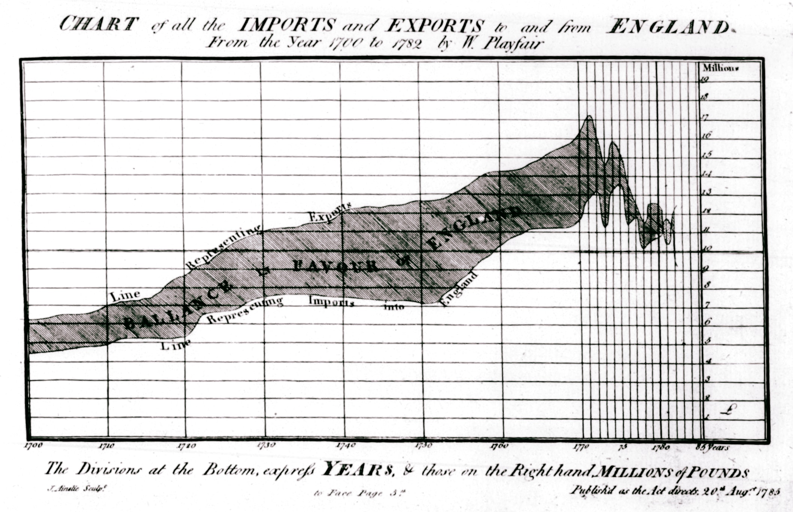

```{r}
#| label: setup
#| include: false
source("_common.R")
```

## História: Fechando o Ciclo com William Playfair

::: {.callout-note appearance="minimal"}

## Fechando o ciclo: o primeiro gráfico de Playfair

Chegamos ao último tipo de gráfico deste livro — e, ironicamente, ao *primeiro* que **William Playfair** inventou. O gráfico de linhas foi publicado em *The Commercial and Political Atlas* [@playfair1786], onde Playfair apresentou 43 séries temporais da balança comercial inglesa com diversas nações ao longo do século XVIII. A mesma obra continha o gráfico de barras (que vimos no capítulo sobre [Barras](cap05-barras.qmd)); o gráfico de pizza viria quinze anos depois, no *Statistical Breviary* de 1801 (capítulo sobre [Pizza](cap04-pizza.qmd)).

Se o gráfico de linhas é historicamente o primeiro, por que aparece por último neste livro? Porque, dos três, é o mais complexo conceitualmente: envolve séries temporais, continuidade, sazonalidade e a noção de que a *ordem* dos pontos importa. Barras e pizza comparam categorias; linhas revelam *tendências*. Essa complexidade justifica deixá-lo para o final — quando o leitor já domina os fundamentos da visualização [@costiganeaves1990]. Uma reprodução comentada da obra original, com introdução de Howard Wainer e Ian Spence, está disponível em @playfair2005.



:::

Na medicina, gráficos de linha são essenciais para monitorar tendências de pacientes, acompanhar epidemias e entender como variáveis mudam ao longo do tempo. Mas, como veremos, muitos profissionais os usam incorretamente.

## O Que é um Gráfico de Linha?

Um gráfico de linha é uma representação visual que conecta pontos sequenciais com linhas para mostrar **mudanças ao longo de uma variável ordenada** — tipicamente o tempo. A linha não é apenas decorativa: ela comunica continuidade e tendência.

**Componentes principais:**  

- **Eixo X (horizontal)**: Uma variável contínua ou ordenada (datas, tempo, semanas, etc.).  
- **Eixo Y (vertical)**: Uma variável numérica que queremos acompanhar.  
- **Linhas**: Conectam pontos sucessivos para revelar padrões e tendências.  

## Quando Usar Gráficos de Linha

Gráficos de linha são ideais para:

- **Séries temporais**: Pressão arterial de um paciente ao longo de 12 semanas
- **Dados longitudinais**: Peso corporal medido mensalmente durante um ano
- **Comparação de tendências**: Internações hospitalares em múltiplos departamentos ao longo de um ano
- **Ciclos e sazonalidade**: Taxa de infecções respiratórias por estação
- **Monitoramento clínico**: Evolução de marcadores laboratoriais (glicose, colesterol) em resposta a tratamento

## Quando Não Usar — O Erro Clássico

::: {.callout-warning}
## O Erro Clássico: Linhas em Dados Categóricos

A maior falha na visualização moderna é usar gráficos de linha para conectar **categorias que não possuem ordem natural**.

Exemplos de **erros comuns**:

- Conectar diferentes doenças em um eixo X (infarto, diabetes, câncer)
- Conectar medicações diferentes (Aspirina, Ibuprofeno, Paracetamol)
- Conectar departamentos hospitalares (Cardiologia, Neurologia, Oncologia)

Quando você desenha uma linha conectando essas categorias, você está criando uma ilusão de continuidade onde não existe. A linha sugere que há algo entre "Cardiologia" e "Neurologia", o que não faz sentido.

**Solução**: Use barras, pontos, ou box plots para dados categóricos.
:::

## Variações e Extensões

### Gráfico de Linha Simples

A forma mais básica: uma linha mostrando uma variável ao longo do tempo.

### Múltiplas Linhas

Use cores ou estilos diferentes para comparar tendências de múltiplos grupos:

- Admissões hospitalares por departamento
- Níveis de glicose em pacientes com diferentes biótipos
- Evolução de peso em diferentes grupos de tratamento

### Linha + Área

Preenche a área sob a linha, útil para enfatizar magnitude acumulada.

### Gráfico Interativo (Plotly)

Permite zoom, hover para detalhes, e visibilidade/invisibilidade de linhas — excelente para apresentações e websites.

## Exemplos Práticos com R

### Exemplo 1: Série Temporal Simulada — Admissões Hospitalares

Vamos simular dados realistas de admissões hospitalares mensais com padrão sazonal:

```{r}
#| message: false
#| warning: false

# Simular dados de admissões hospitalares mensais com sazonalidade
set.seed(42)
meses <- seq(as.Date("2022-01-01"), as.Date("2023-12-31"), by = "month")
admissoes_base <- 150
sazonalidade <- 30 * sin(seq(0, 4*pi, length.out = length(meses)))
ruido <- rnorm(length(meses), 0, 15)
admissoes <- admissoes_base + sazonalidade + ruido

dados_admissoes <- tibble(
  data = meses,
  admissoes = pmax(round(admissoes), 50),  # Garante valores positivos
  mes = month(data, label = TRUE, locale = "pt_BR")
)

dados_admissoes |>
  head(10) |>
  mutate(data = format(data, "%b/%Y")) |>
  select(data, admissoes) |>
  kbl(
    col.names = c("Mês/Ano", "Admissões"),
    caption = "Primeiros 10 meses de admissões hospitalares simuladas"
  ) |>
  kable_styling(
    bootstrap_options = c("striped", "hover", "condensed", "responsive"),
    full_width = FALSE,
    position = "center",
    font_size = 14
  ) |>
  row_spec(0, bold = TRUE, color = "white", background = "#2563EB") |>
  column_spec(1, bold = TRUE)
```

Agora criamos o gráfico:

```{r}
#| fig-width: 10
#| fig-height: 5

ggplot(dados_admissoes, aes(x = data, y = admissoes)) +
  geom_line(color = "#2E86AB", linewidth = 1) +
  geom_point(color = "#2E86AB", size = 2) +
  tema_graficos() +
  labs(
    title = "Internações Hospitalares Mensais (2022-2023)",
    subtitle = "Padrão sazonal com aumento em períodos de frio",
    x = "Data",
    y = "Número de Admissões",
    caption = "Dados simulados para fins educacionais"
  ) +
  scale_y_continuous(limits = c(0, NA))
```

Observe a sazonalidade clara — mais internações no inverno.

### Exemplo 2: Múltiplas Linhas — Comparação por Departamento

```{r}
#| message: false
#| warning: false

# Simular admissões por departamento
departamentos <- c("Cardiologia", "Neurologia", "Pneumologia")
dados_departamentos <- expand_grid(
  data = seq(as.Date("2022-01-01"), as.Date("2023-12-31"), by = "month"),
  departamento = departamentos
) %>%
  mutate(
    base = case_when(
      departamento == "Cardiologia" ~ 60,
      departamento == "Neurologia" ~ 40,
      departamento == "Pneumologia" ~ 50
    ),
    sazonalidade = 15 * sin(seq(0, 4*pi, length.out = n())) *
                   (departamento == "Pneumologia"),
    ruido = rnorm(n(), 0, 8),
    admissoes = pmax(round(base + sazonalidade + ruido), 10)
  ) %>%
  select(data, departamento, admissoes)

dados_departamentos |>
  head(12) |>
  mutate(data = format(data, "%b/%Y")) |>
  kbl(
    col.names = c("Mês/Ano", "Departamento", "Admissões"),
    caption = "Primeiros 12 registros de admissões por departamento"
  ) |>
  kable_styling(
    bootstrap_options = c("striped", "hover", "condensed", "responsive"),
    full_width = FALSE,
    position = "center",
    font_size = 14
  ) |>
  row_spec(0, bold = TRUE, color = "white", background = "#2563EB") |>
  column_spec(1, bold = TRUE)
```

Visualizar múltiplas linhas com cores distintas:

```{r}
#| fig-width: 11
#| fig-height: 6

ggplot(dados_departamentos, aes(x = data, y = admissoes, color = departamento)) +
  geom_line(linewidth = 1) +
  geom_point(size = 2) +
  tema_graficos() +
  scale_color_manual(values = paleta_cat) +
  labs(
    title = "Admissões por Departamento (2022-2023)",
    subtitle = "Pneumologia mostra padrão sazonal; Cardiologia e Neurologia mais estáveis",
    x = "Data",
    y = "Número de Admissões",
    color = "Departamento",
    caption = "Dados simulados para fins educacionais"
  ) +
  scale_y_continuous(limits = c(0, NA))
```

### Exemplo 3: Linha + Área para Dados Acumulados

```{r}
#| message: false
#| fig-width: 10
#| fig-height: 5

# Dados de casos confirmados acumulados
dados_casos <- tibble(
  data = seq(as.Date("2023-01-01"), as.Date("2023-12-31"), by = "week"),
  casos_novos = c(5, 8, 12, 15, 18, 22, 20, 18, 15, 12, 10, 8, 6, 4, 3, 2, 1,
                  2, 3, 4, 5, 6, 7, 8, 9, 10, 9, 8, 7, 6, 5, 4, 3, 2, 1, 1,
                  0, 0, 0, 0, 0, 0, 0, 0, 0, 0, 0, 0, 0, 0, 0, 0, 1)
) %>%
  mutate(casos_acumulados = cumsum(casos_novos))

ggplot(dados_casos, aes(x = data, y = casos_acumulados)) +
  geom_area(fill = "#A23B72", alpha = 0.3) +
  geom_line(color = "#A23B72", linewidth = 1.2) +
  geom_point(color = "#A23B72", size = 2) +
  tema_graficos() +
  labs(
    title = "Casos Acumulados de Doença Infecciosa",
    subtitle = "Visão agregada da magnitude total do evento",
    x = "Data",
    y = "Total de Casos Acumulados",
    caption = "Dados simulados para fins educacionais"
  ) +
  scale_y_continuous(limits = c(0, NA))
```

### Exemplo 4: Versão Interativa com Plotly

```{r}
#| message: false
#| fig-width: 11
#| fig-height: 6

# Versão interativa das admissões por departamento
p_interativa <- ggplot(dados_departamentos, aes(x = data, y = admissoes,
                                                 color = departamento)) +
  geom_line(linewidth = 1) +
  geom_point(size = 2, aes(text = paste0(
    departamento, "<br>",
    "Data: ", format(data, "%b %Y"), "<br>",
    "Admissões: ", admissoes
  ))) +
  tema_graficos() +
  scale_color_manual(values = paleta_cat) +
  labs(
    title = "Admissões por Departamento (Interativo)",
    x = "Data",
    y = "Número de Admissões",
    color = "Departamento"
  )

plotly::ggplotly(p_interativa, tooltip = "text") %>%
  para_plotly()
```

## O ERRO do Gráfico da JAMA Psychiatry

Em 2020, Solís-Vivanco e colaboradores publicaram na *JAMA Psychiatry* um estudo que investigava o comprometimento cognitivo em indivíduos do espectro da esquizofrenia que nunca haviam recebido medicação [@solisvivanco2020]. O objetivo era esclarecer se os déficits cognitivos são progressivos ou se já estão presentes desde o primeiro episódio psicótico. Os autores avaliaram diferentes domínios cognitivos — memória, atenção, funções executivas, linguagem — em pacientes em estágios distintos da doença.

Um dos gráficos da publicação cometeu o erro clássico: **conectou domínios cognitivos (categorias) com linhas**, como se houvesse uma continuidade natural entre eles. Isso é **fundamentalmente errado**. Não há "continuidade" entre Memória e Atenção — são domínios qualitativamente distintos. A linha cria uma ilusão de ordem ou sequência que não existe nos dados.

### Recriando o Erro

Vamos simular um cenário similar — scores cognitivos em diferentes domínios — e mostrar o erro e a correção:

```{r}
#| message: false

# Dados simulados: scores de diferentes domínios cognitivos
dominios_cognitivos <- tibble(
  dominio = c("Memória", "Atenção", "Função\nExecutiva", "Linguagem"),
  score_saudavel = c(95, 92, 90, 94),
  score_esquizofrenia = c(65, 58, 55, 62)
) %>%
  pivot_longer(
    cols = starts_with("score_"),
    names_to = "grupo",
    values_to = "score"
  ) %>%
  mutate(
    grupo = case_when(
      grupo == "score_saudavel" ~ "Controle",
      grupo == "score_esquizofrenia" ~ "Esquizofrenia"
    )
  )

dominios_cognitivos |>
  pivot_wider(names_from = grupo, values_from = score) |>
  kbl(
    col.names = c("Domínio Cognitivo", "Controle", "Esquizofrenia"),
    caption = "Scores cognitivos simulados por domínio e grupo"
  ) |>
  kable_styling(
    bootstrap_options = c("striped", "hover", "condensed", "responsive"),
    full_width = FALSE,
    position = "center",
    font_size = 14
  ) |>
  row_spec(0, bold = TRUE, color = "white", background = "#2563EB") |>
  column_spec(1, bold = TRUE)
```

### ❌ ERRO: Linhas em Dados Categóricos

```{r}
#| fig-width: 10
#| fig-height: 5
#| warning: false

# ERRADO! Conectando categorias com linhas
ggplot(dominios_cognitivos, aes(x = dominio, y = score, color = grupo, group = grupo)) +
  geom_line(linewidth = 1.2) +
  geom_point(size = 3) +
  tema_graficos() +
  scale_color_manual(values = paleta_cat) +
  labs(
    title = "❌ ERRO: Domínios Cognitivos Conectados com Linhas",
    subtitle = "A linha implica continuidade entre categorias — INCORRETO!",
    x = "Domínio Cognitivo",
    y = "Score Cognitivo",
    color = "Grupo"
  ) +
  ylim(0, 100)
```

Veja o problema: a linha entre "Memória" e "Atenção" sugere que há algo entre elas. Não há!

### ✅ CORRETO: Barras ou Pontos sem Linhas

```{r}
#| fig-width: 10
#| fig-height: 5

# CORRETO! Usando barras
ggplot(dominios_cognitivos, aes(x = dominio, y = score, fill = grupo)) +
  geom_col(position = "dodge", width = 0.7) +
  tema_graficos() +
  scale_fill_manual(values = paleta_cat) +
  labs(
    title = "✅ CORRETO: Domínios Cognitivos com Barras",
    subtitle = "Sem linhas — cada categoria é independente",
    x = "Domínio Cognitivo",
    y = "Score Cognitivo",
    fill = "Grupo"
  ) +
  ylim(0, 100)
```

Agora é claro: cada domínio é uma categoria separada. Não há "continuidade" entre eles.

### Alternativa: Pontos sem Linhas

```{r}
#| fig-width: 10
#| fig-height: 5

# Alternativa: apenas pontos
ggplot(dominios_cognitivos, aes(x = dominio, y = score, color = grupo)) +
  geom_point(size = 4) +
  tema_graficos() +
  scale_color_manual(values = paleta_cat) +
  labs(
    title = "✅ TAMBÉM CORRETO: Pontos sem Linhas",
    subtitle = "Simples, claro, sem implicações falsas de continuidade",
    x = "Domínio Cognitivo",
    y = "Score Cognitivo",
    color = "Grupo"
  ) +
  ylim(0, 100)
```

## Resumo: Quando Usar Linhas

**Use linhas quando:**

- A variável X é **contínua ou naturalmente ordenada** (tempo, idade, distância)
- Você quer enfatizar **tendência e mudança**
- Os pontos intermediários fazem sentido

**NÃO use linhas quando:**

- A variável X é **categórica sem ordem natural**
- Os pontos intermediários **não fazem sentido**
- Você quer comparar categorias independentes

---

## Quiz

::: {.callout-note title="Quizz"}

**Pergunta 1:** Um pesquisador criou um gráfico mostrando taxa de mortalidade (eixo Y) vs. cinco tipos diferentes de câncer (eixo X), conectando os pontos com linhas. Isso é apropriado?

a) Sim, porque há cinco categorias no eixo X
b) Não, porque tipos de câncer são categorias sem uma sequência natural.
c) Sim, porque a taxa de mortalidade é numérica
d) Talvez, depende da revista

::: {.callout-note  title="Resposta" collapse="true"}
**b) Não, porque tipos de câncer são categorias sem uma sequência natural.**
Gráficos de linha comunicam **continuidade e tendência** — a linha entre dois pontos sugere que existe algo entre eles. Tipos de câncer são categorias sem ordem natural: não há um "meio-caminho" entre câncer de mama e câncer de pulmão. Ao conectar categorias sem ordem com linhas, criamos uma impressão visual falsa. O fato de o eixo Y ser numérico (alternativa c) não justifica usar linhas — o que importa é a natureza do eixo X. Para dados categóricos, use barras ou pontos.
:::

**Pergunta 2:** Qual é o principal risco de usar um gráfico de linha para dados categóricos?

a) O gráfico fica muito colorido
b) Cria ilusão de continuidade onde não existe
c) Usa mais tinta
d) Fica difícil imprimir

::: {.callout-note  title="Resposta" collapse="true"}
**b) Cria ilusão de continuidade onde não existe.**
Como vimos na seção "O Erro Clássico", a linha entre dois pontos implica que os valores intermediários são significativos. Quando conectamos "Cardiologia" e "Neurologia" com uma linha, sugerimos visualmente que existe uma transição contínua entre esses departamentos — o que é absurdo. Esse é o erro mais frequente na visualização de dados em saúde: usar linhas onde deveria haver barras.
:::

**Pergunta 3:** Você está monitorando o peso de um paciente ao longo de 6 meses (medições mensais). Qual visualização é melhor?

a) Barras
b) Pizza
c) Linhas com pontos
d) Tabela numérica

::: {.callout-note  title="Resposta" collapse="true"}
**c) Linhas com pontos.**
Aqui temos uma variável numérica (peso) medida ao longo do tempo (6 meses), com medições ordenadas cronologicamente — exatamente o cenário ideal para gráficos de linha. Os pontos marcam as medições reais, e a linha entre eles revela a tendência (ganho, perda ou estabilidade de peso). Pizza (alternativa b) não serve porque não mostra evolução temporal. Barras (alternativa a) até funcionariam, mas não comunicam a continuidade e a tendência tão bem quanto a linha. A tabela (alternativa d) mostra os números, mas não revela padrões visuais.
:::

**Pergunta 4:** Em um gráfico de linha com múltiplos grupos, qual é a melhor forma de diferenciar os grupos?

a) Usar cores diferentes
b) Usar padrões diferentes nas linhas (tracejado, pontilhado)
c) Usar ambas (cores + padrões)
d) Adicionar anotações de texto

::: {.callout-note  title="Resposta" collapse="true"}
**c) Usar ambas (cores + padrões).**
Cores sozinhas (alternativa a) funcionam para a maioria dos leitores, mas aproximadamente 8% dos homens e 0,5% das mulheres têm algum grau de daltonismo. Para essas pessoas, duas linhas de cores diferentes podem parecer idênticas. Padrões sozinhos (alternativa b) resolvem o daltonismo, mas são mais difíceis de distinguir à distância. A combinação de cores *e* padrões (por exemplo, azul contínuo vs. vermelho tracejado) cria **redundância visual**: mesmo que o leitor não perceba a diferença de cor, o padrão da linha ainda permite distinguir os grupos. Esse princípio de redundância é uma das boas práticas fundamentais em visualização acessível.
:::

:::

---

## Referências {.unnumbered}

::: {#refs}
:::
