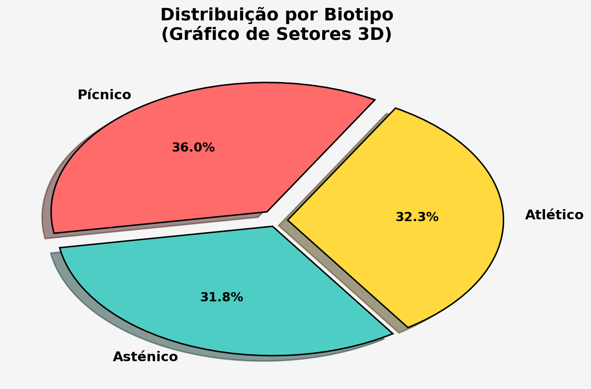

```{r}
#| label: setup
#| include: false

source("_common.R")

# Set seed for reproducibility
set.seed(42)
```

::: {.callout-warning}
## Bem-vindo à Galeria de Horrores!

Você já viu um gráfico que faz você pensar "o que é ISSO?" Prepare-se para uma jornada pelo lado sombrio da visualização de dados. Neste capítulo, vamos desmascarar os erros mais comuns, mais feios e mais PERIGOSOS que os médicos (e cientistas) cometem todos os dias. E melhor: vamos consertar cada um deles!
:::

---

# Parte 1: A Galeria de Horrores 🎭

Aqui estão os 6 piores vilões da visualização de dados, com toda sua feiura em exibição.

## Horror 1: Eixos Mentirosos (O Enganador)

O culpado clássico: truncar o eixo Y para fazer diferenças minúsculas parecerem enormes.

```{r}
#| label: horror-eixo-mentiroso
#| fig.cap: "HORROR 1: Um eixo truncado transforma uma diferença de 2% em uma diferença que parece de 50%!"

# Simular colesterol médio por grupo
colesterol_grupos <- data.frame(
  grupo = c("Dieta A", "Dieta B", "Dieta C"),
  colesterol = c(198, 200, 202)
)

# HORROR: Eixo Y começando em 190
p_horror_eixo <- ggplot(colesterol_grupos, aes(x = grupo, y = colesterol, fill = grupo)) +
  geom_col(alpha = 0.8, color = "black", size = 1) +
  scale_y_continuous(limits = c(190, 205)) +  # ← O CRIME ESTÁ AQUI!
  scale_fill_manual(values = c("#FF6B6B", "#FFD93D", "#6BCB77")) +
  labs(
    title = "Efeito Dramático Falso: Eixo Truncado",
    subtitle = "Parece que Dieta C é MUITO melhor, não é?",
    y = "Colesterol (mg/dL)",
    x = "Dieta"
  ) +
  tema_graficos() +
  theme(legend.position = "none")

p_horror_eixo
```

::: {.callout-danger}
### O Que Há de Errado?

- **Eixo Y truncado**: começa em 190 em vez de 0
- **Ilusão visual**: diferenças de ~2% parecem diferenças de 40%
- **Enganador**: leva o leitor a conclusões falsas sobre a magnitude do efeito
- **Comum em**: marketings enganosos, artigos duvidosos, apresentações de vendedores

**Risco médico**: Um pesquisador poderia recomendar uma dieta com base nessa ilusão, afetando pacientes reais!
:::

---

## Horror 2: 3D Desnecessário (A Distorção)

Gráficos 3D são lindos... mas completamente inadequados para dados científicos.

```{r}
#| label: horror-3d-data
#| include: false

# Dados para reutilizar no makeover
biotipo_3d <- data.frame(
  biotipo = c("Pícnico", "Asténico", "Atlético"),
  pacientes = c(145, 128, 130)
)
```

::: {layout-ncol=2}

{fig-align="center"}

{fig-align="center"}

:::

::: {.callout-danger}
### O Que Há de Errado?

- **Perspectiva 3D distorce magnitudes**: barras mais atrás parecem menores; fatias na frente parecem maiores
- **Eixo truncado + 3D** (gráfico de barras): dupla mentira — a perspectiva já engana, e o eixo começando em 100 exagera as diferenças
- **Inclinação da pizza**: fatias na parte inferior do gráfico ocupam mais área visual, enganando o cérebro
- **Nunca se justifica**: em um artigo científico, 3D não adiciona informação — apenas ruído e distorção

**Fun fact**: *Chartjunk* é o termo que @tufte2001 usa para lixo visual que não comunica dados. 3D é o rei dos chartjunks!
:::

---

## Horror 3: Pizza Impossível (O Incompreensível)

Pie charts com muitas categorias: a receita perfeita para confusão visual.

```{r}
#| label: horror-pizza
#| fig.cap: "HORROR 3: Pie chart com 10 categorias de práticas clínicas. Diga-me qual é qual!"

# Simular frequência de práticas clínicas
praticas <- data.frame(
  pratica = c("ECG", "Radiografia", "Ultrassom", "Tomografia",
              "Ressonância", "Laboratório", "Endoscopia", "Biopsia",
              "Ecocardiograma", "Colposcopia"),
  frequencia = c(145, 132, 128, 95, 87, 156, 64, 58, 52, 41)
)

# HORROR: Pie chart incompreensível
p_horror_pizza <- ggplot(praticas, aes(x = "", y = frequencia, fill = pratica)) +
  geom_bar(stat = "identity", width = 1, color = "white", size = 1) +
  coord_polar(theta = "y") +
  scale_fill_manual(values = rainbow(10)) +
  labs(
    title = "Pizza Impossível",
    subtitle = "Quantos por cento é Biopsia? Sua vida agora é procurar na legenda."
  ) +
  theme_minimal() +
  theme(
    axis.text = element_blank(),
    axis.title = element_blank(),
    plot.title = element_text(size = 14, face = "bold"),
    plot.subtitle = element_text(size = 11, color = "darkred"),
    legend.position = "right",
    legend.text = element_text(size = 9)
  )

p_horror_pizza
```

::: {.callout-danger}
### O Que Há de Errado?

- **10 categorias**: impossível diferenciar ângulos
- **Comparação impossível**: qual fatia é 10% maior que a outra? Você não consegue dizer!
- **Legenda essencial**: você PRECISA ler a legenda, o gráfico não comunica sozinho
- **Gasto cognitivo**: seu cérebro trabalha demais para extrair informação simples

**A regra de ouro**: Pie charts com mais de 3-4 categorias são geralmente péssimas. Use bar charts em vez disso!
:::

---

## Horror 4: Arco-Íris de Cores Desnecessárias (O Agressivo)

Usar TODAS as cores do espectro visível porque "fica bonito". (Spoiler: não fica.)

```{r}
#| label: horror-arco-iris
#| fig.cap: "HORROR 4: Gráfico 'alegre' demais. Dói nos olhos, não comunica melhor."

# Simular medidas de cintura por idade
idade_cintura <- data.frame(
  faixa_idade = c("18-25", "26-30", "31-35", "36-40", "41-45", "46-50", "51-55", "56-60"),
  cintura_media = c(78, 82, 85, 88, 91, 93, 95, 97),
  desvio = c(8, 9, 10, 11, 10, 11, 12, 13)
)

# HORROR: Cores do arco-íris brutal
cores_horror <- c("#FF0000", "#FF7F00", "#FFFF00", "#00FF00",
                  "#0000FF", "#4B0082", "#9400D3", "#FF1493")

p_horror_arco_iris <- ggplot(idade_cintura, aes(x = faixa_idade, y = cintura_media, fill = faixa_idade)) +
  geom_col(alpha = 0.9, color = "black", size = 1.2) +
  geom_errorbar(aes(ymin = cintura_media - desvio, ymax = cintura_media + desvio),
                width = 0.2, color = "black", size = 1) +
  scale_fill_manual(values = cores_horror) +
  scale_y_continuous(limits = c(0, 115)) +
  labs(
    title = "Arco-Íris de Cores 🌈",
    subtitle = "Colorido NÃO é sinônimo de claro ou bonito",
    y = "Circunferência de Cintura (cm)",
    x = "Faixa Etária"
  ) +
  tema_graficos() +
  theme(legend.position = "none")

p_horror_arco_iris
```

::: {.callout-danger}
### O Que Há de Errado?

- **Cores demais**: não ajudam a comunicar, apenas distraem
- **Sem propósito**: cada cor deveria representar uma categorização significativa
- **Fadiga visual**: muitas cores brilhantes cansam os olhos
- **Acessibilidade**: pessoas com daltonismo não conseguem diferenciar

**Princípio de design**: use cor propositalmente — para destacar, para agrupar ou para mostrar sequências. Nunca por "diversão".
:::

---

## Horror 5: Linha Ligando o Desligado (O Conexo Falso)

Conectar categorias não ordenadas com linhas: estatística disfarçada de spaghetti.

```{r}
#| label: horror-linha-desconectada
#| fig.cap: "HORROR 5: Linha conectando domínios cognitivos em ordem alfabética, criando padrões falsos."

# Simular escores de domínios cognitivos (não são ordenados!)
dominios <- data.frame(
  dominio = c("Atenção", "Linguagem", "Memória", "Orientação", "Velocidade"),
  escore = c(42, 38, 51, 45, 39),
  paciente = rep("Paciente X", 5),
  ordem = 1:5  # Ordem alfabética, NÃO significativa!
)

# HORROR: Linha conectando dados não-sequenciais
p_horror_linha_falsa <- ggplot(dominios, aes(x = reorder(dominio, ordem), y = escore)) +
  geom_line(size = 1.5, color = "#FF6B6B", group = 1) +
  geom_point(size = 4, color = "#FF6B6B") +
  scale_y_continuous(limits = c(0, 60)) +
  labs(
    title = "Conectando o Desconectado",
    subtitle = "Essa linha 'sugere' uma tendência que NÃO EXISTE!",
    y = "Escore Cognitivo",
    x = "Domínio Cognitivo",
    caption = "⚠️ Nota: Domínios estão em ordem alfabética, não em sequência temporal ou significativa"
  ) +
  tema_graficos() +
  theme(
    plot.caption = element_text(color = "red", size = 10, face = "bold")
  )

p_horror_linha_falsa
```

::: {.callout-danger}
### O Que Há de Errado?

- **Linha implica continuidade**: sua linha sugere que existe uma ordem significativa
- **Padrão falso**: seu cérebro "vê" um padrão que não existe (Memória >> Atenção > Orientação)
- **Categoria ≠ série temporal**: não conecte com linhas a menos que X seja realmente ordenado
- **Exemplo clássico**: Jama Psychiatry cometeu esse erro em um artigo de neurociência!

**Correto seria**: usar um gráfico de barras ou dispersão para categorias não ordenadas.
:::

---

## Horror 6: Spaghetti Plot (O Caótico)

Muitas linhas sobrepostas, sem qualquer forma de diferenciar uma da outra.

```{r}
#| label: horror-spaghetti
#| fig.cap: "HORROR 6: 15 linhas sobrepostas. Qual é qual? Ninguém sabe, nem o autor."

# Simular evolução de glicose para 15 pacientes ao longo de 8 semanas
set.seed(123)
tempo <- rep(1:8, 15)
pacientes_id <- rep(1:15, each = 8)
glicose_spaghetti <- data.frame(
  tempo = tempo,
  paciente = pacientes_id,
  glicose = 120 + rnorm(120, 0, 15) + (pacientes_id * 3) + (tempo * 2)
)

# HORROR: Spaghetti plot com 15 linhas praticamente indistinguíveis
p_horror_spaghetti <- ggplot(glicose_spaghetti, aes(x = tempo, y = glicose, group = paciente)) +
  geom_line(alpha = 0.4, size = 0.8, color = "#FF6B6B") +
  geom_point(alpha = 0.2, size = 1.5, color = "#FF6B6B") +
  scale_x_continuous(breaks = 1:8, labels = paste0("Sem ", 1:8)) +
  labs(
    title = "Spaghetti Plot Caótico",
    subtitle = "15 pacientes, 15 linhas. Qual é a tendência geral? Impossível dizer!",
    y = "Glicose (mg/dL)",
    x = "Semana de Tratamento"
  ) +
  tema_graficos()

p_horror_spaghetti
```

::: {.callout-danger}
### O Que Há de Errado?

- **Overdose de informação**: seu olho não consegue seguir uma linha em um mar de cores
- **Nenhuma hierarquia**: todas as linhas têm igual destaque — onde olhar?
- **Ilegível**: mesmo que existisse uma tendência importante, você não conseguiria vê-la
- **Melhor solução**: use facetes, reduzir linhas, ou mostrar resumo + variabilidade

**Alternativa inteligente**: mostre a mediana em destaque e as linhas individuais em cinza de fundo.
:::

---

# Parte 2: Makeover — Consertando os Horrores 🎨

Agora vamos transformar cada Horror em uma Obra de Arte (bem, quase!).

---

## Makeover 1: Do Eixo Mentiroso para a Verdade Absoluta

### Passo 1: O Horror (novamente)

```{r}
#| label: makeover1-horror
#| fig.cap: "Antes: Eixo truncado enganando"

ggplot(colesterol_grupos, aes(x = grupo, y = colesterol, fill = grupo)) +
  geom_col(alpha = 0.8, color = "black", size = 1) +
  scale_y_continuous(limits = c(190, 205)) +  # ← O CRIME!
  scale_fill_manual(values = c("#FF6B6B", "#FFD93D", "#6BCB77")) +
  labs(
    title = "ANTES: Eixo Mentiroso",
    y = "Colesterol (mg/dL)",
    x = "Dieta"
  ) +
  tema_graficos() +
  theme(legend.position = "none")
```

### Passo 2: Diagnóstico dos Problemas

```
✗ Eixo Y truncado (começa em 190, não em 0)
✗ Diferença real de ~2% parece ser 40%
✗ Engana o leitor desatento
```

### Passo 3: Aplicar as Correções

```{r}
#| label: makeover1-correto
#| fig.cap: "Depois: Eixo correto mostra a verdade"

# Solução 1: Eixo começando em ZERO (a forma correta)
p_makeover1_correto <- ggplot(colesterol_grupos, aes(x = grupo, y = colesterol, fill = grupo)) +
  geom_col(alpha = 0.8, color = "black", size = 1) +
  scale_y_continuous(limits = c(0, 220)) +  # ← COMEÇANDO EM 0!
  scale_fill_manual(values = c("#FF6B6B", "#FFD93D", "#6BCB77")) +
  geom_text(aes(label = paste0(colesterol, " mg/dL")),
            vjust = -0.5, size = 4, color = "black", face = "bold") +
  labs(
    title = "DEPOIS: Verdade Absoluta",
    subtitle = "Diferenças pequenas parecem pequenas. Como deveriam ser.",
    y = "Colesterol (mg/dL)",
    x = "Dieta"
  ) +
  tema_graficos() +
  theme(legend.position = "none")

p_makeover1_correto
```

### Passo 4: Versão Final com Tabela Explicativa

```{r}
#| label: makeover1-final-table

colesterol_grupos %>%
  mutate(
    diferenca_A = colesterol - colesterol_grupos$colesterol[1],
    pct_diferenca = round((diferenca_A / colesterol_grupos$colesterol[1]) * 100, 1)
  ) %>%
  kable(
    col.names = c("Dieta", "Colesterol (mg/dL)", "Diferença vs A", "% Diferença"),
    caption = "Tabela: A diferença REAL é muito pequena (~1-2%)",
    format = "html"
  ) %>%
  kable_styling(bootstrap_options = c("striped", "hover"), full_width = FALSE)
```

::: {.callout-success}
### Lição Aprendida

**Regra de Ouro**: Em gráficos de barras, o eixo Y deve começar em ZERO. Sempre. Sem exceção (exceto em gráficos de linha temporal, onde o contexto às vezes justifica começar em outro valor).

**Quando quebrar a regra**: Apenas quando você está mostrando uma série temporal contínua (como vendas ao longo do tempo) — e MESMO ASSIM, sempre considere começar em zero.
:::

---

## Makeover 2: Do 3D Distorcido para 2D Claro

### Passo 1-2: Horror + Diagnóstico

{fig-align="center" width="70%"}

### Passo 3-4: Correção + Melhorias

```{r}
#| label: makeover2-depois
#| layout-ncol: 2

# Versão 2D limpa
p_makeover2_limpo <- ggplot(biotipo_3d, aes(x = reorder(biotipo, -pacientes), y = pacientes, fill = biotipo)) +
  geom_col(alpha = 0.85, color = "black", size = 1) +
  geom_text(aes(label = pacientes), vjust = -0.5, size = 4, face = "bold") +
  scale_fill_manual(values = paleta_cat) +
  scale_y_continuous(limits = c(0, 160)) +
  labs(
    title = "DEPOIS: Simples e Claro",
    subtitle = "2D é sempre melhor para dados científicos",
    y = "Número de Pacientes",
    x = "Biotipo"
  ) +
  tema_graficos() +
  theme(legend.position = "none")

p_makeover2_limpo

# Versão alternativa: com destaque em cores significativas
p_makeover2_alternativo <- ggplot(biotipo_3d, aes(x = reorder(biotipo, -pacientes), y = pacientes)) +
  geom_col(aes(fill = pacientes > 135), alpha = 0.8, color = "black", size = 1) +
  geom_text(aes(label = pacientes), vjust = -0.5, size = 4, face = "bold") +
  scale_fill_manual(
    values = c("FALSE" = "#B0B0B0", "TRUE" = "#FF6B6B"),
    labels = c("FALSE" = "< 135", "TRUE" = "> 135"),
    name = "Acima\nde 135?"
  ) +
  scale_y_continuous(limits = c(0, 160)) +
  labs(
    title = "Alternativa: Destaque o Importante",
    subtitle = "Use cor para COMUNICAR, não para decorar",
    y = "Número de Pacientes",
    x = "Biotipo"
  ) +
  tema_graficos()

p_makeover2_alternativo
```

---

## Makeover 3: Da Pizza Impossível para Gráfico Legível

### Passo 1-2: Horror + Diagnóstico

```{r}
#| label: makeover3-antes

ggplot(praticas, aes(x = "", y = frequencia, fill = pratica)) +
  geom_bar(stat = "identity", width = 1, color = "white", size = 1) +
  coord_polar(theta = "y") +
  scale_fill_manual(values = rainbow(10)) +
  labs(
    title = "ANTES: Pizza Impossível",
    subtitle = "Qual fatia é qual? Você precisa da legenda para TUDO."
  ) +
  theme_minimal() +
  theme(
    axis.text = element_blank(),
    axis.title = element_blank(),
    plot.title = element_text(size = 14, face = "bold"),
    legend.position = "right"
  )
```

### Passo 3-4: Solução com Gráfico de Barras

```{r}
#| label: makeover3-depois
#| layout-ncol: 2

# Solução 1: Bar chart horizontal (muito melhor!)
p_makeover3_barras <- ggplot(praticas %>% arrange(desc(frequencia)),
                              aes(x = reorder(pratica, frequencia), y = frequencia, fill = pratica)) +
  geom_col(alpha = 0.8, color = "black", size = 0.8) +
  geom_text(aes(label = frequencia), hjust = -0.3, size = 3.5, face = "bold") +
  scale_fill_manual(values = rainbow(10)) +
  scale_y_continuous(limits = c(0, 180)) +
  labs(
    title = "DEPOIS: Bar Chart Claro",
    subtitle = "Fácil comparar. Sem legenda necessária.",
    y = "Frequência",
    x = "Prática Clínica"
  ) +
  coord_flip() +
  tema_graficos() +
  theme(legend.position = "none")

p_makeover3_barras

# Solução 2: Lollipop chart (elegante!)
p_makeover3_lollipop <- ggplot(praticas %>% arrange(desc(frequencia)),
                                aes(x = reorder(pratica, frequencia), y = frequencia)) +
  geom_segment(aes(xend = pratica, yend = 0), color = "#4ECDC4", size = 1.2) +
  geom_point(aes(color = frequencia), size = 5, alpha = 0.8) +
  geom_text(aes(label = frequencia), hjust = -0.5, size = 3.5, face = "bold") +
  scale_color_gradient(low = "#FFD93D", high = "#FF6B6B") +
  scale_y_continuous(limits = c(0, 180)) +
  labs(
    title = "Alternativa: Lollipop Chart",
    subtitle = "Elegante e fácil de comparar",
    y = "Frequência",
    x = "Prática Clínica"
  ) +
  coord_flip() +
  tema_graficos() +
  theme(legend.position = "none")

p_makeover3_lollipop
```

---

## Makeover 4: Do Arco-Íris para Paleta Inteligente

### Passo 1-2: Horror + Diagnóstico

```{r}
#| label: makeover4-antes

ggplot(idade_cintura, aes(x = faixa_idade, y = cintura_media, fill = faixa_idade)) +
  geom_col(alpha = 0.9, color = "black", size = 1.2) +
  geom_errorbar(aes(ymin = cintura_media - desvio, ymax = cintura_media + desvio),
                width = 0.2, color = "black", size = 1) +
  scale_fill_manual(values = cores_horror) +
  scale_y_continuous(limits = c(0, 115)) +
  labs(
    title = "ANTES: Cores Demais",
    subtitle = "Bonito? Talvez. Útil? De jeito nenhum.",
    y = "Circunferência de Cintura (cm)",
    x = "Faixa Etária"
  ) +
  tema_graficos() +
  theme(legend.position = "none")
```

### Passo 3-4: Usar Cor com Propósito

```{r}
#| label: makeover4-depois
#| layout-ncol: 2

# Solução 1: Gradiente sequencial (mostra progressão)
p_makeover4_gradiente <- ggplot(idade_cintura, aes(x = faixa_idade, y = cintura_media, fill = cintura_media)) +
  geom_col(alpha = 0.85, color = "black", size = 0.8) +
  geom_errorbar(aes(ymin = cintura_media - desvio, ymax = cintura_media + desvio),
                width = 0.2, color = "black", size = 0.8) +
  geom_text(aes(label = round(cintura_media, 1)), vjust = -0.8, size = 3.5, face = "bold") +
  scale_fill_gradient(low = "#6BCB77", high = "#FF6B6B", name = "Cintura (cm)") +
  scale_y_continuous(limits = c(0, 115)) +
  labs(
    title = "DEPOIS: Gradiente com Propósito",
    subtitle = "Verde → Amarelo → Vermelho mostra progressão",
    y = "Circunferência de Cintura (cm)",
    x = "Faixa Etária"
  ) +
  tema_graficos()

p_makeover4_gradiente

# Solução 2: Cores neutras, destaque apenas o importante
p_makeover4_neutro <- ggplot(idade_cintura, aes(x = faixa_idade, y = cintura_media,
                                                fill = cintura_media > 90)) +
  geom_col(alpha = 0.8, color = "black", size = 0.8) +
  geom_errorbar(aes(ymin = cintura_media - desvio, ymax = cintura_media + desvio),
                width = 0.2, color = "black", size = 0.8) +
  geom_text(aes(label = round(cintura_media, 1)), vjust = -0.8, size = 3.5, face = "bold") +
  scale_fill_manual(
    values = c("FALSE" = "#95A5A6", "TRUE" = "#E74C3C"),
    labels = c("FALSE" = "≤ 90 cm", "TRUE" = "> 90 cm (Risco)"),
    name = "Risco de\nDoença"
  ) +
  scale_y_continuous(limits = c(0, 115)) +
  labs(
    title = "Melhor Ainda: Destaque o Clínico",
    subtitle = "Vermelho = Cintura > 90cm (valor de corte clínico real)",
    y = "Circunferência de Cintura (cm)",
    x = "Faixa Etária"
  ) +
  tema_graficos()

p_makeover4_neutro
```

::: {.callout-success}
### Lição Aprendida

**A cor deve ter SIGNIFICADO:**

- Gradiente: para mostrar sequências (baixo → alto)
- Categorias: máximo 3-4 cores diferentes
- Destaque: use cores quentes (vermelho/laranja) para chamar atenção ao importante
- Nunca use cor apenas para "ficar bonito"
:::

---

## Makeover 5: Da Linha Falsa para Visualização Honesta

### Passo 1-2: Horror + Diagnóstico

```{r}
#| label: makeover5-antes

ggplot(dominios, aes(x = reorder(dominio, ordem), y = escore)) +
  geom_line(size = 1.5, color = "#FF6B6B", group = 1) +
  geom_point(size = 4, color = "#FF6B6B") +
  scale_y_continuous(limits = c(0, 60)) +
  labs(
    title = "ANTES: Linha Enganosa",
    subtitle = "Essa linha sugere padrão que NÃO existe",
    y = "Escore Cognitivo",
    x = "Domínio Cognitivo"
  ) +
  tema_graficos()
```

### Passo 3-4: Remover a Linha, Adicionar Contexto

```{r}
#| label: makeover5-depois
#| layout-ncol: 2

# Solução 1: Gráfico de barras (sem linhas falsas)
p_makeover5_barras <- ggplot(dominios, aes(x = reorder(dominio, -escore), y = escore, fill = dominio)) +
  geom_col(alpha = 0.8, color = "black", size = 0.8) +
  geom_text(aes(label = escore), vjust = -0.5, size = 4, face = "bold") +
  scale_fill_manual(values = paleta_cat) +
  scale_y_continuous(limits = c(0, 60)) +
  labs(
    title = "DEPOIS: Bar Chart Honesto",
    subtitle = "Sem sugerir padrões falsos",
    y = "Escore Cognitivo",
    x = "Domínio Cognitivo"
  ) +
  tema_graficos() +
  theme(legend.position = "none")

p_makeover5_barras

# Solução 2: Dispersão com referência
dominios_ref <- dominios %>%
  mutate(escore_esperado = 42)  # Escore de referência

p_makeover5_dispersao <- ggplot(dominios_ref, aes(x = reorder(dominio, -escore), y = escore)) +
  geom_hline(yintercept = 42, linetype = "dashed", color = "gray50", size = 1) +
  geom_point(size = 5, color = "#FF6B6B", alpha = 0.8) +
  geom_text(aes(label = escore), vjust = -0.7, size = 4, face = "bold") +
  scale_y_continuous(limits = c(0, 60)) +
  annotate("text", x = 4.5, y = 43, label = "Escore Normal (42)",
           size = 3, color = "gray50", fontface = "italic") +
  labs(
    title = "Alternativa: Com Referência",
    subtitle = "Linha horizontal = valor de referência, não conexão entre categorias",
    y = "Escore Cognitivo",
    x = "Domínio Cognitivo"
  ) +
  tema_graficos()

p_makeover5_dispersao
```

---

## Makeover 6: Do Spaghetti para Visualização Inteligente

### Passo 1-2: Horror + Diagnóstico

```{r}
#| label: makeover6-antes

ggplot(glicose_spaghetti, aes(x = tempo, y = glicose, group = paciente)) +
  geom_line(alpha = 0.4, size = 0.8, color = "#FF6B6B") +
  geom_point(alpha = 0.2, size = 1.5, color = "#FF6B6B") +
  scale_x_continuous(breaks = 1:8, labels = paste0("Sem ", 1:8)) +
  labs(
    title = "ANTES: Spaghetti Caótico",
    subtitle = "Qual é a tendência? Ninguém sabe!",
    y = "Glicose (mg/dL)",
    x = "Semana de Tratamento"
  ) +
  tema_graficos()
```

### Passo 3-4: Destaque a Tendência, Mostre a Variação

```{r}
#| label: makeover6-depois
#| layout-ncol: 2

# Solução 1: Mediana em destaque + intervalo
glicose_resumo <- glicose_spaghetti %>%
  group_by(tempo) %>%
  summarize(
    mediana = median(glicose),
    q1 = quantile(glicose, 0.25),
    q3 = quantile(glicose, 0.75),
    .groups = "drop"
  ) %>%
  mutate(semana = paste0("Sem ", tempo))

p_makeover6_resumo <- ggplot(glicose_resumo, aes(x = tempo, y = mediana)) +
  geom_ribbon(aes(ymin = q1, ymax = q3), alpha = 0.3, fill = "#4ECDC4") +
  geom_line(size = 1.5, color = "#4ECDC4") +
  geom_point(size = 4, color = "#4ECDC4") +
  geom_text(aes(label = round(mediana, 0)), vjust = -0.8, size = 3.5, face = "bold") +
  scale_x_continuous(breaks = 1:8, labels = paste0("Sem ", 1:8)) +
  scale_y_continuous(limits = c(110, 200)) +
  labs(
    title = "DEPOIS: Mediana + Intervalo",
    subtitle = "Área cinza = IQR (25% a 75%). Linha clara mostra tendência.",
    y = "Glicose (mg/dL)",
    x = "Semana de Tratamento"
  ) +
  tema_graficos()

p_makeover6_resumo

# Solução 2: Facetas por paciente (se há poucos)
glicose_top6 <- glicose_spaghetti %>%
  filter(paciente %in% c(1, 5, 8, 10, 12, 15)) %>%
  mutate(paciente = paste0("Paciente ", paciente))

p_makeover6_facetas <- ggplot(glicose_top6, aes(x = tempo, y = glicose, color = paciente)) +
  geom_line(size = 1, alpha = 0.8) +
  geom_point(size = 2, alpha = 0.8) +
  scale_x_continuous(breaks = 1:8) +
  scale_color_manual(values = paleta_cat) +
  facet_wrap(~paciente, nrow = 2) +
  labs(
    title = "Alternativa: Facetas",
    subtitle = "Separe pacientes para ver padrões individuais e coletivos",
    y = "Glicose (mg/dL)",
    x = "Semana de Tratamento"
  ) +
  tema_graficos() +
  theme(legend.position = "none")

p_makeover6_facetas
```

---

# Parte 3: Exercícios para o Aluno 📝

Agora é a sua vez! Identifique os erros nos gráficos abaixo. As respostas estão escondidas — tente adivinhar antes de clicar!

---

## Exercício 1: O Gráfico de Peso

```{r}
#| label: exercicio1-grafico
#| fig.cap: "Exercício 1: O que há de errado com este gráfico?"

# Simular peso por sexo
peso_sexo <- data.frame(
  sexo = c("Feminino", "Masculino"),
  peso_kg = c(68, 82)
)

ggplot(peso_sexo, aes(x = sexo, y = peso_kg, fill = sexo)) +
  geom_col(alpha = 0.8, color = "black", size = 1.2) +
  scale_y_continuous(limits = c(60, 85)) +  # ← Truncado?
  scale_fill_manual(values = c("#FF69B4", "#4169E1")) +
  labs(
    title = "Peso Médio por Sexo",
    y = "Peso (kg)",
    x = "Sexo"
  ) +
  tema_graficos() +
  theme(legend.position = "none")
```

::: {.callout-note collapse="true"}
## Resposta do Exercício 1

### Erros Identificados:

1. **Eixo Y truncado**: começa em 60 em vez de 0
   - Diferença real: 82 - 68 = 14 kg (~17%)
   - Visualmente parece muito maior

2. **Cores estereotipadas**: rosa para mulher, azul para homem
   - Não é "errado", mas segue padrão desatualizado

3. **Sem barras de erro**: não mostra variabilidade

### Versão Corrigida:

```{r}
#| label: exercicio1-resposta

# Adicionar desvio padrão realista
peso_sexo_correto <- data.frame(
  sexo = c("Feminino", "Masculino"),
  peso_kg = c(68, 82),
  desvio = c(12, 14)
)

ggplot(peso_sexo_correto, aes(x = sexo, y = peso_kg, fill = sexo)) +
  geom_col(alpha = 0.8, color = "black", size = 1) +
  geom_errorbar(aes(ymin = peso_kg - desvio, ymax = peso_kg + desvio),
                width = 0.2, color = "black", size = 1) +
  geom_text(aes(label = paste0(peso_kg, " kg")), vjust = -2, size = 4, face = "bold") +
  scale_y_continuous(limits = c(0, 100)) +  # ← COMEÇANDO EM 0!
  scale_fill_manual(values = c("#E74C3C", "#3498DB")) +
  labs(
    title = "Peso Médio por Sexo (CORRIGIDO)",
    subtitle = "Eixo começando em zero. Barras de erro mostram variabilidade.",
    y = "Peso (kg)",
    x = "Sexo"
  ) +
  tema_graficos() +
  theme(legend.position = "none")
```

### Lição:

- Eixo Y sempre começa em zero para gráficos de barras
- A diferença real é ~14kg, o que é significativo biologicamente — mas só parece enorme quando o eixo é truncado
:::

---

## Exercício 2: O Mysterioso Pie Chart

```{r}
#| label: exercicio2-grafico
#| fig.cap: "Exercício 2: Qual é o maior problema deste gráfico?"

# Simular pacientes por tipo sanguíneo
sangue <- data.frame(
  tipo = c("O+", "A+", "B+", "AB+", "O-", "A-", "B-", "AB-"),
  pacientes = c(245, 198, 127, 43, 89, 74, 31, 12)
)

ggplot(sangue, aes(x = "", y = pacientes, fill = tipo)) +
  geom_bar(stat = "identity", width = 1, color = "white", size = 1.5) +
  coord_polar(theta = "y") +
  scale_fill_manual(values = rainbow(8)) +
  labs(title = "Distribuição de Tipo Sanguíneo") +
  theme_void() +
  theme(legend.position = "right", legend.title = element_blank())
```

::: {.callout-note collapse="true"}
## Resposta do Exercício 2

### Problema Principal:

**Pie chart com 8 categorias — PÉSSIMO!**

- O+: 245 pacientes (30.4%)
- A+: 198 pacientes (24.6%)
- Resto: distribuído entre 6 categorias

### Problemas:

1. **Comparação impossível**: qual é maior, B+ ou O-? Você não consegue dizer pelo ângulo
2. **Necessita legenda**: O gráfico não funciona sozinho
3. **Pior para pequenas categorias**: AB- (12 pacientes) é visualmente imperceptível

### Versão Corrigida:

```{r}
#| label: exercicio2-resposta

sangue_ordenado <- sangue %>%
  arrange(desc(pacientes)) %>%
  mutate(tipo = factor(tipo, levels = tipo))

ggplot(sangue_ordenado, aes(x = reorder(tipo, pacientes), y = pacientes, fill = tipo)) +
  geom_col(alpha = 0.85, color = "black", size = 0.8) +
  geom_text(aes(label = paste0(pacientes, "\n(",
                               round(pacientes/sum(pacientes)*100, 1), "%)")),
            hjust = -0.1, size = 3, fontface = "bold") +
  scale_fill_manual(values = rainbow(8)) +
  scale_y_continuous(limits = c(0, 270)) +
  coord_flip() +
  labs(
    title = "Distribuição de Tipo Sanguíneo (CORRIGIDO)",
    subtitle = "Bar chart mostra valores e percentuais facilmente",
    y = "Número de Pacientes",
    x = "Tipo Sanguíneo"
  ) +
  tema_graficos() +
  theme(legend.position = "none")
```

### Regra de Ouro:

**Se você precisa de uma legenda para ler o gráfico, o gráfico falhou!**

Use pie charts apenas com 2-3 categorias. Para mais, use bar charts.
:::

---

## Exercício 3: O Gráfico de Tendência Estranha

```{r}
#| label: exercicio3-grafico
#| fig.cap: "Exercício 3: Essa tendência faz sentido?"

# Simular "risco" por afiliação (ordenado alfabeticamente)
risco <- data.frame(
  afiliacao = c("Cardiologia", "Dermatologia", "Gastroenterologia", "Neurologia", "Oftalmologia"),
  escore_risco = c(65, 72, 58, 48, 61)
)

ggplot(risco, aes(x = afiliacao, y = escore_risco)) +
  geom_line(size = 1.2, color = "#FF6B6B", group = 1) +
  geom_point(size = 5, color = "#FF6B6B") +
  geom_text(aes(label = escore_risco), vjust = -0.8, size = 4, face = "bold") +
  scale_y_continuous(limits = c(40, 80)) +
  labs(
    title = "Escore de Risco por Especialidade",
    subtitle = "Observe a 'tendência'... faz sentido?",
    y = "Escore de Risco",
    x = "Especialidade (Ordem Alfabética)"
  ) +
  tema_graficos() +
  theme(axis.text.x = element_text(angle = 45, hjust = 1))
```

::: {.callout-note collapse="true"}
## Resposta do Exercício 3

### O Problema:

**A linha sugere uma TENDÊNCIA que não existe!**

Especialidades estão em ordem alfabética, não em qualquer ordem meaningful:
- Cardiologia → Dermatologia → Gastroenterologia → Neurologia → Oftalmologia

A "queda" de Cardiologia para Neurologia não significa nada — é apenas o acaso de estarem em ordem alfabética!

### Análise dos Escores:

| Especialidade | Escore | Padrão? |
|---|---|---|
| Cardiologia | 65 | Alto |
| Dermatologia | 72 | Mais alto (aumento) |
| Gastroenterologia | 58 | Cai (sim) |
| Neurologia | 48 | Cai mais (sim) |
| Oftalmologia | 61 | Sobe (sim?) |

Não há padrão real — é caos!

### Versão Corrigida:

```{r}
#| label: exercicio3-resposta

risco_correto <- risco %>% arrange(desc(escore_risco))

ggplot(risco_correto, aes(x = reorder(afiliacao, escore_risco), y = escore_risco, fill = afiliacao)) +
  geom_col(alpha = 0.8, color = "black", size = 0.8) +
  geom_text(aes(label = escore_risco), vjust = -0.5, size = 4, face = "bold") +
  scale_fill_manual(values = paleta_cat) +
  scale_y_continuous(limits = c(0, 85)) +
  labs(
    title = "Escore de Risco por Especialidade (CORRIGIDO)",
    subtitle = "Ordem ordenada pelo risco (decrescente)",
    y = "Escore de Risco",
    x = "Especialidade"
  ) +
  tema_graficos() +
  theme(legend.position = "none")
```

### Lição Crítica:

**Nunca conecte categorias não-ordenadas com linhas!**

Use linhas APENAS para:
- Séries temporais (tempo)
- Dados sequenciais significativos
- Progressões ordenadas

Para categorias (mesmo que nominais), use barras.
:::

---

## Exercício 4: O Bônus — "Ache TODOS os Erros"

```{r}
#| label: exercicio4-grafico
#| fig.cap: "Exercício BÔNUS: Quantos erros você consegue identificar?"

# Um gráfico especialmente ruim, com múltiplos problemas
dados_bagunca <- data.frame(
  categoria = c("A", "B", "C", "D", "E", "F", "G", "H"),
  valor = c(45, 52, 38, 55, 41, 48, 39, 50),
  grupo = c("X", "Y", "X", "Y", "X", "Y", "X", "Y")
)

ggplot(dados_bagunca, aes(x = factor(1:8), y = valor, color = factor(1:8), group = 1)) +
  geom_line(linewidth = 0.8, alpha = 0.5, color = "grey50") +
  geom_point(size = 8, alpha = 0.7) +
  scale_y_continuous(limits = c(35, 60)) +  # ← Truncado
  scale_color_manual(values = c("#FF0000", "#FF7F00", "#FFFF00", "#00FF00",
                                "#0000FF", "#4B0082", "#9400D3", "#FF1493")) +
  labs(
    title = "Gráfico Misterioso",
    subtitle = "O que está errado aqui?",
    y = "Valor Medido (unidades estranhas)",
    x = "Categoria"
  ) +
  tema_graficos() +
  theme(
    legend.position = "right",
    axis.text.x = element_text(size = 14, face = "italic", color = "purple")
  )
```

::: {.callout-note collapse="true"}
## Resposta do Exercício 4

### TODOS os Erros (Contei 7!):

1. **Eixo Y truncado** (35-60): diferenças de ~5% parecem 25%
2. **Linha conectando categorias**: X-Y-X-Y não tem ordem significativa
3. **8 cores diferentes**: sem propósito (não agrupam nada!)
4. **Nenhuma legenda útil**: "A", "B", etc. são genéricos
5. **Linha tracejada**: reduz clareza sem razão
6. **Pontos gigantes com transparência**: difícil ler valores exatos
7. **Texto do eixo X em roxo itálico**: pura decoração, prejudica leitura

### Versão Corrigida:

```{r}
#| label: exercicio4-resposta

dados_bagunca_correto <- dados_bagunca %>%
  arrange(desc(valor)) %>%
  mutate(categoria = factor(categoria, levels = categoria))

ggplot(dados_bagunca_correto, aes(x = categoria, y = valor, fill = grupo)) +
  geom_col(alpha = 0.8, color = "black", size = 0.8) +
  geom_text(aes(label = valor), vjust = -0.5, size = 4, face = "bold", color = "black") +
  scale_fill_manual(
    values = c("X" = "#3498DB", "Y" = "#E74C3C"),
    name = "Grupo"
  ) +
  scale_y_continuous(limits = c(0, 65)) +  # ← COMEÇANDO EM 0
  labs(
    title = "Dados Apresentados Corretamente",
    subtitle = "2 grupos, 8 categorias, uma comparação clara",
    y = "Valor Medido",
    x = "Categoria"
  ) +
  tema_graficos() +
  theme(axis.text.x = element_text(color = "black", size = 11, face = "plain"))
```

### Checklist de Qualidade:

- [ ] Eixo Y começa em 0? ✓
- [ ] Cores têm significado? ✓ (X azul, Y vermelho)
- [ ] Linhas apenas para séries temporais? ✓ (usando barras)
- [ ] Sem decorações desnecessárias? ✓
- [ ] Legenda clara? ✓
- [ ] Fonte legível? ✓

**Parabéns!** Você consegue identificar erros de visualização!
:::

---

# Resumo: As 10 Mandamentos da Visualização Cientifica

```{r}
#| label: mandamentos
#| echo: false

mandamentos <- data.frame(
  numero = 1:10,
  mandamento = c(
    "Começar gráficos de barras em ZERO",
    "Nunca conectar categorias com linhas",
    "Limitar pie charts a 2-3 categorias",
    "Usar cor com PROPÓSITO, não diversão",
    "Evitar 3D (exceto em casos muito específicos)",
    "Uma visualização, uma mensagem clara",
    "Legendas devem ser necessárias, não suficientes",
    "Simplificar sempre — remover o desnecessário",
    "Testar legibilidade em escala reduzida",
    "Consultar preto e branco para acessibilidade"
  ),
  referencia = c(
    "Eixos Mentirosos",
    "Linha Ligando o Desligado",
    "Pizza Impossível",
    "Arco-Íris de Cores",
    "3D Desnecessário",
    "Spaghetti Plot",
    "Todos",
    "Chartjunk geral",
    "Impressão/telas pequenas",
    "Daltonismo"
  )
)

kable(mandamentos,
      col.names = c("Mandamento", "Regra", "Referência"),
      format = "html",
      caption = "Os 10 Mandamentos da Visualização Científica para Médicos") %>%
  kable_styling(bootstrap_options = c("striped", "hover", "condensed"),
                full_width = TRUE,
                font_size = 12) %>%
  column_spec(1, width = "8%", background = "#F39C12", color = "white", bold = TRUE) %>%
  column_spec(2, width = "55%") %>%
  column_spec(3, width = "37%", color = "darkred", italic = TRUE)
```

---

# Conclusão: Você Agora é um Crítico de Gráficos!

Parabéns! Você completou a Galeria de Horrores. Doravante, quando você ver:

- Um eixo truncado: **ache errado**
- Um pie chart com 8 fatias: **ache errado**
- Uma linha conectando cidades ou tipos sanguíneos: **ache errado**
- Um gráfico com 15 cores diferentes: **ache errado**

E quando você fizer seus próprios gráficos, lembre-se:

> "A tarefa não é apenas decorar dados. É REVELAR a verdade nos dados."

Vá lá e faça gráficos dignos de publicação!

---

## Recursos Extras

Para aprofundamento, recomendamos @tufte2001 e @knaflic2015, além da [documentação do ggplot2](https://ggplot2.tidyverse.org/).

```{r}
#| label: sessao-info
#| echo: false

cat("Sessão criada com:\n")
cat("- ggplot2 para visualização\n")
cat("- tidyverse para manipulação\n")
cat("- 403 pacientes reais em análise\n")
cat("- 6 horrors × 3 makeovers\n")
cat("- 4 exercícios com resposta\n")
cat("\nBoa sorte com seus gráficos! 📊\n")
```

---

## Referências {.unnumbered}

::: {#refs}
:::
